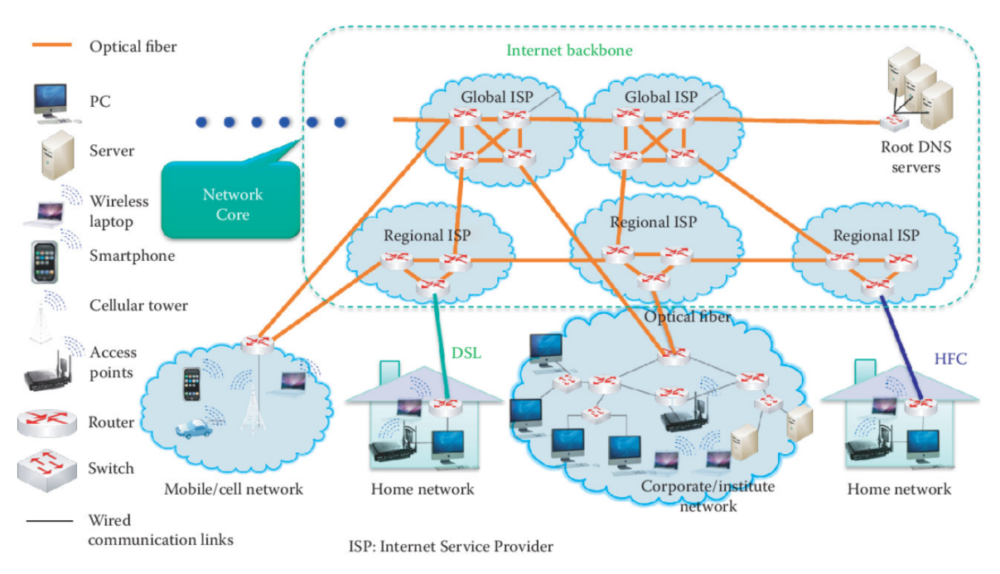
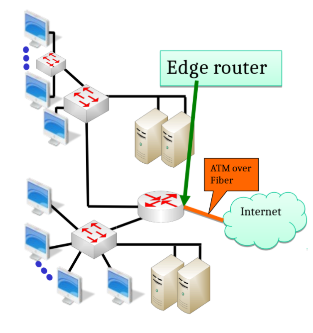
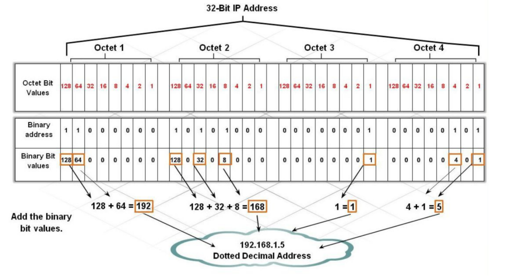
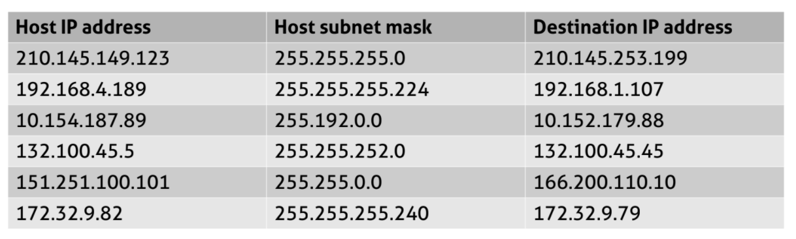
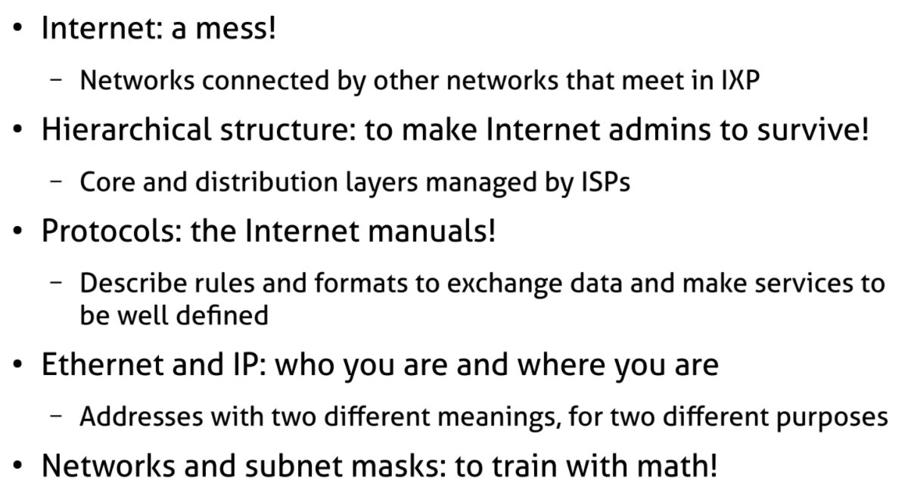

# Networking 101

## What is the Internet?

- An interconnected network of networks
  - `Hierarchical` networks
    * Internet backbone: connecting the ISPs' backbones
    * ISP backbone: connecting organizations' backbones
    * Organization backbone connects local area networks(LANs)
    * LAN connects end systems
  - Public vs private Internet
- Internet Standards
  - RFC: Request for comments
  - IETF: Internet Engineering Task Force
  
## Internet hierarchy

- Network edge
  - Hosts: server,client,P2P
  - Applications: http,mail,Facebook,Twitter
- Network Core
  - Edge router:connecting an organization/ISP to the internet
  - Interconnection of routers using fiber
  - Naming services
- Access networks
  - Wired,wireless communication links

>   

## Internet core Management

- Routers and fiber-links form the internet; Routers works together to figure out the `most efficient path` for routing a packet and *Distributed Alg.* can adapt to changing internet conditions
- The core is provided by *`ISPs`* that *`interconnect`* multiple continents
  - Global IPSs or Tier-1 ISPs
  - Regional ISPs or Tier-2 ISPs
- internet Backbone connects tier-1 ISPs
  - e.g., Verizon,Sprint,AT&T,QWest...
- The Backbones of Tier-1 ISPs are interconnected at various access points called
`Internet eXchange Points`(IXP)

## Protocols

- Specify rules about the desired service
  - Procedure Rules
    * Types and sequences of messages exchanged `syntax and semantics`
    * Actions to take with respect to messages and events
  - Message Format: format,size,coding of messages
  - Timing: the time to wait between any event
- Modularization → Many protocols for each layer
  - Hides implementation details
  - Highly choesive + Low Coupling → Layers can change without disturbing other layers
- Packet Switching-Time Division multiple access(TDMA)
  - best effort delivery
  - Better for resource sharing
- Network congestion and flow control

## Access Layer

>   

- Organization/home LANs or subnet connects hosts to edge router
- Internet uses a `gateway-edge router` to connect a LANs or subnet to the hierarchical network
- ATM: asynchronous transfer mode
- Residential Internet Access:
    - Point to Point protocol(PPP) for access to an ISP
    - DSL: digital subscriber line
    - Cable modem
    - Fiber to the Loop
    - Satellite
    - Broadband over power line or wireless(WiMAX)
- nodes of the same network can directly communicate among them(Ethernet family protocols)

## Ethernet (IEEE 802.3) networks

- each host in Ethernet networks has a `NIC-network internet card` with a "generally" fixed address
- MAC addresses are *48 bits(6 bytes)* long and UNIQUELY identify hosts in the network
- each host only processes packets,with fixed format, intended for it
- `How build one?` All hosts connected together with a `shared transmission system` based on Ethernet are a network as if they were connected to the same medium
  - two-Many computer connected with Eth. cables to a single device (generally `Switch,repeater,hub,bridges...`)

### Ethernet Broadcast Domain

- An Ethernet network constitutes a `Broadcast Domain`
  * also exists collision domains but full-duplex and switches have made them obsolete
- Ideally frames sent in a broadcast domain are potentially `received by all the hosts` in the network (receive all + only read some)

### Switches

- switches *segment* the ethernet network " or collision domain" to limit the explosion of packets
in the network (only broadcast mss are "replicated")
  * Switches `will forward broadcast traffic` on all their interfaces, except the one they received the broadcast on
- switches remember the source MAC addresses on differerent ports
  * `Tables of MAC`: ARP tables for hosts || CAM table for Switches
- they only replicate the frame where the destination MAC address replies

### Why internet is not a large Ethernet net?

- Ethernet makes high use of Broadcast packets → `inefficient` for large networks
- large Networks usually are split in order to reduce the broadcast domain
- There is the need of a LOGICAL division of networks
  * Ethernet is Access layer but we need a Distribution layer
- Hosts in a local net use a `default gateway` to go out and have access to the Distribution Layer
- Ethernet is part of `Data link or Network Access layer`
- Distribution layer is based on `IP, the internet Protocol`

## Distribution and core Layers

- interconnect local networks among them
- Distribution layer is at level of `Autonomous Systems` like big enterprises and ISPs
- Core layer is at the level of `continents`
- they are connected by `Routers` and uses `logical Addressing`: IP
- Routers are the `default gateways` and gives access to the internet

## Ethernet vs IP Addresses

- Ethernet has physical addresses
  - you can not(***) change the MAC address of your NICs
  - Eth address tells `WHO` you are, but does not tell anything on WHERE you are

*** inside we use original MAC; outside the Eth. net we create new MAC address(of the GW) therefore we `destroy and recreate the frame` every time we enter a new Eth. network.

*** usually mac change for every hop. and IP address destination usually does not change;
ip addr change when using NAT

- IP has `LOGICAL` addresses
  - you can change IP address of your NIC
  - tells `WHERE` you are and it changes if you go somewhere
  - IP addresses are used to `identify and reach` networks and hosts
  - local-remote addresses
    * Directly connected → local Address (if both of you are in the same room)
    * else→Remote Address (you need to know before sending the mss)
  - how to know if one IP is in the same network as you? → `Subnet Mask`
  - [Subnet Mask](https://it.wikipedia.org/wiki/Maschera_di_sottorete) defines boundaries between network portion and host portion of the IP address

## IP Addresses

> IPv4 address with 32 bits in four octets(8 bits each) 

> IPv6 address with 128 bits ([IPv6 wiki](https://it.wikipedia.org/wiki/IPv6))

- There are three types of IP addresses
    - Unicast(one to one): refer to a `single destination` host
    - Broadcast(one to all): refer `to every host` on the network or subnet
    - Multicast(one to many): refer to `a group of` IP addresses ion a network, not all of them
- IP Addressing, [Classful](https://it.wikipedia.org/wiki/Classi_di_indirizzi_IP): how we `divide net/host` portion of IP address in a `static way`
    - Class A(24 bits for Host addresses, /8)
    - Class B(16 bits for //, /16) Class C(8 bits for //, /24)
    - Class D([Multicast](https://en.wikipedia.org/wiki/Multicast_address)): no subnet mask is used here; all 32 bits dened a network Group
    - Class E(Reserved)

>   

- `Routable` addresses need to be unique on the internet
- `Non-Routable` addresses are defined in [RFC1918](https://it.wikipedia.org/wiki/Indirizzo_IP_privato)(private addresses)
- 192.168.8.0/24 Class C IP address
    - First address is reserved for `network address`
    - Last address is reserved for `broadcast address`
    $$ 2^{32 - netmask} - 2 $$
> #hosts in any [CIDR](https://it.wikipedia.org/wiki/Supernetting) specified network

## Variable Length Subnet Mask(VLSM)

- Introduced by CIDR(Classless Inter-Domain Routing) as new notation for the netmask as a `flexible way` to allocate the `right number` of hosts in each context
- specify how many bits of the 32-bit total will specify the network address `/x`
- The remaining bits specify the host addresses
- 192.168.1.248/30
  $$ 2^{32−30} − 2 = 2\ hosts$$
  $$ 192.168.1.248\ is\ Network\ Address$$
  $$ 192.168.1.251\ is\ Broadcast\ Address$$
- [RFC 3021](https://datatracker.ietf.org/doc/html/rfc3021): Using `31-Bit prefixes` on IPv4 Point-to-Point Links

## VLSM Addresses examples 

Determine the network part,host part, the network size(numb
of hosts), the network address,the broadcast address,and the type of IP addresses
[(bin converter)](https://www.rapidtables.com/convert/number/binary-to-decimal.html)

- 192.168.4.32 netmask 255.255.255.224
    - $224 → (11100000)_2$ it follows that subnet is `/27`
    - host portion is 5bits and number of hosts in the network are $2^{32−27} − 2 = 30$
    - network address: $192.168.4.(001|00000)_2 = 192.168.4.32/27$
    - broadcast address: $192.168.4.(001|11111)_2 = 192.168.4.63$
    - type of IP address is VLSM derived from a Class C Address
- 10.11.12.0/21
    - host portion of 11bits hosts in the network $2^{32−21} − 2 = 2046$
    - network address: $10.11.(00001|000)_2.0 = 10.11.8.0$
    - broadcast address: $10.11.(00001|111.11111111)_2 = 10.11.15.255$

## Remote Addresses examples

> the destination address is remote or local? if it belongs to
the same network than the host **find /x and check if destination is inside the range of the host network**

>   

>   

## Layering Concepts 

Communication between hosts is organized in tasks, assigned to a `Layer`
- Offer a `service` to the User in the layer above + exploit the services offered the layer above
- Tasks involves the exchange of messages that follow a set of rules desined by a `protocol`
- Each layer adds some `protocol information` and provides data to the layer below
- Encapsulation/Decapsulation:
  1. Each layer *adds* some protocol information and provides the data to the *layer below*
  2. the Physical layer sends data over the *physical medium* to the destination
  3. Each protocol in the destination *reads* the appropriate *protocol information* and forwards
  the data to the *layer above*

## Layer ideal representation

ˆ Transport: the illusion of direct end-to-end connection between processes
ˆ Network: transferring data between arbitrary nodes
ˆ Data Link: transferring data between directly connected systems (cable,shared medium)

## Layered architectures 
All architectures refers to the same type of computer communications
network: Packet switched network where every packet is supposed to travel independently from
others
ˆ Each layer has a type of address:
 Application ly: internet name (www.sapienza.it)
 Transport ly: Port number in the range [0..65535] that identies the client or server
application-service
 Internet ly: IP address that identies a host in a network (where it is) a.b.c.d/h
 Datalink ly: MAC address that identies a network card (who it is) A:B:C:D:E:F
## Transport layer: TCP and UDP
ˆ UDP: no control on data exchange (connection-less)
ˆ TCP: Reliable data exchange + Control Flow + Bigger header + TCP handshake
ˆ TCP/IP and Data Communications Administration Guide

## Well-Known Ports 
Range is [0..65535]; Source port is randomly chosen by OS but destination
port determines the required service(application)
20
Figure 22: TCP Handshake
ˆ Assigned Ports [0..1023] are said "well-known ports" and used for standard internet applications:
TCP/UDP Ports Wiki
ˆ common Well-known ports
ˆ Ports [1024..49151] can be registered with internet Application Naming Authority IANA
ˆ Ports [49152..65535] ephemeral ports

TCP UDP
FTP 20-21 SSH 22 DNS 53 DHCP 67-68
Telnet 23 SMTP 25 TFTP 69 SNMP 161
SMTP 25 HTTP 80 RIP 520
IMAP 143 SSL 443