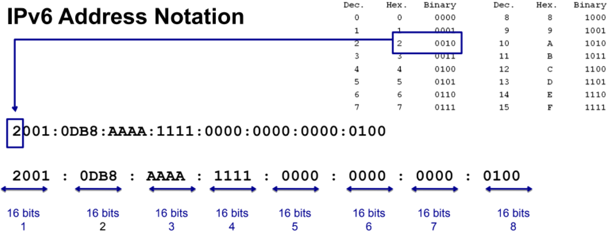

# IPv6 Addressing

## Benefits of IPv6  

- not a new protocol (late 1990s)
- Solve IPv4 shortage of Addresses: **128-bit address space**, written in hexadecimal
- Stateless Configuration and DHCPv6 Stateful
- End-to-End reachability **without private addresses** and **NAT** (not a security feature)
- Better support for mobility: [RFC6275](https://datatracker.ietf.org/doc/html/rfc6275)
- Peer-to-Peer networking easier to create and maintain + more robust QOS and VOIP

--> IPv6 **Source** is always `Unicast` || IPv6 **Destination** can be `Unicast, Multicast or Anycast`

## Hex and IPv6 Address Representation

>([addr types](https://oracle-patches.com/en/cloud-net/ipv6-address-types-unicast,-multicast,-and-anycast)) IPv6 addresses are **128-bit** divided in **(8 x 16-bit)** segments or **hextets** in range [0000:FFFF]
> and Represented as **Hexadecimal digits**: `1 hex digit = 4 Binary bits` separated by ":"


>   
	<p align = "center" >
	<em> IPv6 Address types </em>
</p>


### Compressing IPv6 Addresses Rules

1. `Leading` zeros in any segment do not have to be written , `tailing` zeros must be included
2. Any single, **contiguous segment** of all zeros can be represented with double column `::`
			
## IPv6 Global Unicast Addresses (GUA)

>GUA is identified as `2000::/3` up to `3FFF::/3`
``` 
first 3 binary bits of first hextet 
2000:: --> 0010 0000 0000 0000 ::
-...	   ---. .... .... .... 
```
- Globally `Unique and routable` as IPv4 public addresses; GUA is 1/8th of all addressable space
- **2001:DB8::/32** are reserved for documentation
- All end users will have a global Unicast address					

>  <p align = "center" >
	<em> IPv6 Address Notation </em>
</p>

- Given a *Global Routing Prefix* we can `subnet with 1 hextet` creating up to 65k subnets:
  - `Prefix:` equivalent to *Network address* of IPv4
  - `Prefix length:` equivalent to *subnet mask* of IPv4
  - `Interface ID:` equivalent to *host portion* of an IPv4 address
  - we use `3-1-4 rule` for divide a GUA into `IPv6 /64 local networks` as shown:

>  <p align = "center" >	
	<em> 3-1-4 rule </em>
</p>

## IPv6 Link-Local Unicast Addresses

> link-local is identified as `FE80::/10` up to `FEBF::/10` 
```
first 10 binary bits of first 3 hextets
FE80:: --> 1111 1110 1000 0000:: ==> FEBF:: --> 1111 1110 1011 1111::
---.	   ---- ---- --.. ....                  ---- ---- --.. ....
```

- Used to communicate with other devices `on the link` then `Not Routable`
- `Only have to be unique on the link` (Network segment-internal lan)
- `every IPv6 device` must have `at least` a Link-local address

They are usually created `Automatically` and statically for Routers:
- there are two ways for construct the `Interface ID`:
	- `Random 64 bits` for many hosts
	- Extended unique Identifier 64 [(EUI-64)](https://community.cisco.com/t5/networking-documents/understanding-ipv6-eui-64-bit-address/ta-p/3116953)

>   <p align = "center" >	
	<em> Link-Local Unicast Address </em>
</p>

### EUI-64

Starting from a 48-bit MAC address
  1. the MAC address is separated into `two 24-bits` called OUI(Organizationally Unique Identifier) and the Device Identifier
  2. The 16-bit hextet `0xFFFE` is then inserted between the two 24-bits parts
  3. then the `seventh bit` from the left or the `Universal/local(U/L) bit` is flipped

### Why we use Link-local Addresses?


> Link-Local addresses have an `Important role` in IPv6

→ Used as `Source IPv6 Address` before a device gets one dynamically (SLAAC || DHCPv6)

→ Router's link-local address is used by devices as `default gateway`

→ used by Routers for exchange `routing messages`

→ used by Routers as the `next-hop address` in the routing table


## IPv6 Multicast Addresses

> How send single packet `to multiple destinations` simultaneously? (one-to-many)
>  <p align = "center" >	
	<em> Multicast Address </em>
</p>

* exists two types of Multicast addresses:
> 1. Assigned as `FF00::/8` up to `FFFF::/8` 
```
first 8 binary bits of first 2 hextets 
FF00:: --> 1111 1111 0000 0000:: ==> FFFF:: → 1111 1111 1111 1111::
--..       ---- ---- .... ....       --..     ---- ---- .... ....
```
> 2. Solicited-Node as `FF02::1:FF00:0000/104` 
```bash
fe80::2aa:ff:fe28:9c5a/104                  IPv6 unicast/anycast address (compressed notation)
               -- ----                      the least-significant 24-bits
ff02::1:ff00:0/104                          Solicited-Node multicast address prefix
----  - --                                  The first 104 bits
ff02::1:ff28:9c5a                           Solicited-Node multicast address (compressed notation)
          ** ****
```
  - *generated from `least-significant 24-bits` of Uni/Anycast address*
  - used in the Neighbor Discovery Protocol(NDP) for `Duplicate Address Detection(DAD)`
  - <em>" The Solicited-Node multicast addresses are generated from the host's IPv6 unicast or anycast address, and `each interface must have` a Solicited-Node multicast address associated with it "</em>
    -  [Wiki to Solicited-node Address Example](https://en.wikipedia.org/wiki/Solicited-node_multicast_address)

### scope

4bit field that define the `range` of the Multicast packet:
  - inside Broadcast domain(2)
  - all $eth_x$ of one router(5) *(need to be Enabled)*

|Range|scope value|||
|-|-|-|-|
|Reserved|0|Interface-Local|1|
|Link-Local|2|Site-Local|5|
|Organization-Local|8|Global|E|

### Flag

- 0 :: `Permanent` for [well-known Multicast addresses](https://www.ciscopress.com/articles/article.asp?p=2803866&seqNum=5) assigned by IANA
- 1 :: `Non-permanently-assigned` , "dynamically" assigned

> Well-known Assigned IPv6 Multicast Addresses [IANA-Reference](https://www.iana.org/assignments/ipv6-multicast-addresses/ipv6-multicast-addresses.xhtml)
>  <p align = "center" >	
	<em> Link-local scope Assigned MultiCast Addresses </em>
</p>

>  <p align = "center" >	
	<em> Site-local scope Assigned MultiCast Addresses </em>
</p>

- <u>All IPv6 Devices:</u> `FF02::1` All devices including the router
- every IPv6 device will listen and process packets
- more efficient that IPv4 Ethernet Broadcast

>  <p align = "center" >	
	<em> Router Advertisement </em>
</p>

- <u>All IPv6 Routers:</u> `FF02::2` All Routers
- used by devices to communicate with IPv6 Routers

>  <p align = "center" >	
	<em> Router Solicitation </em>
</p>
