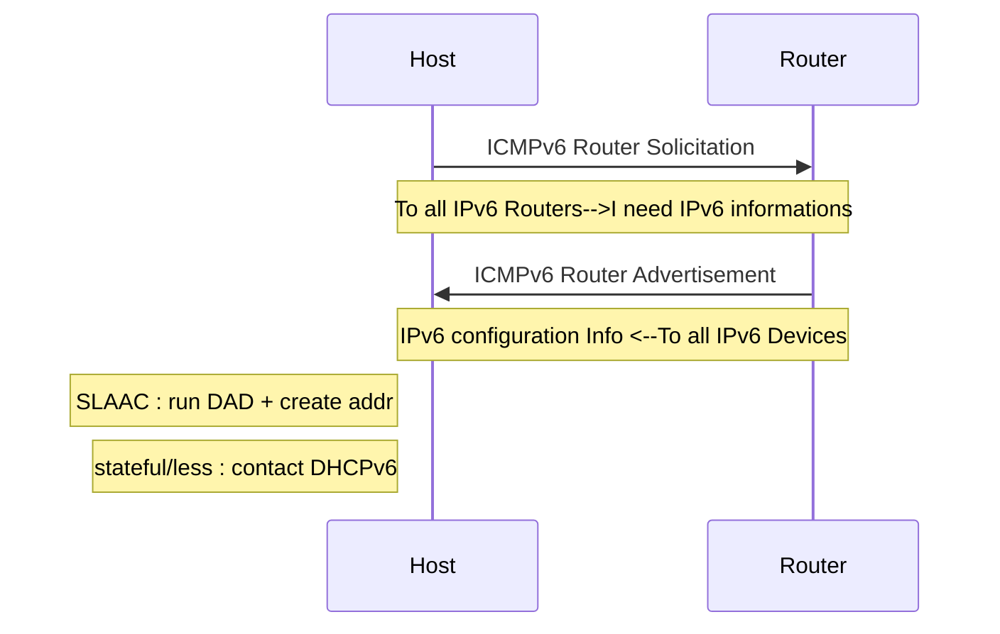
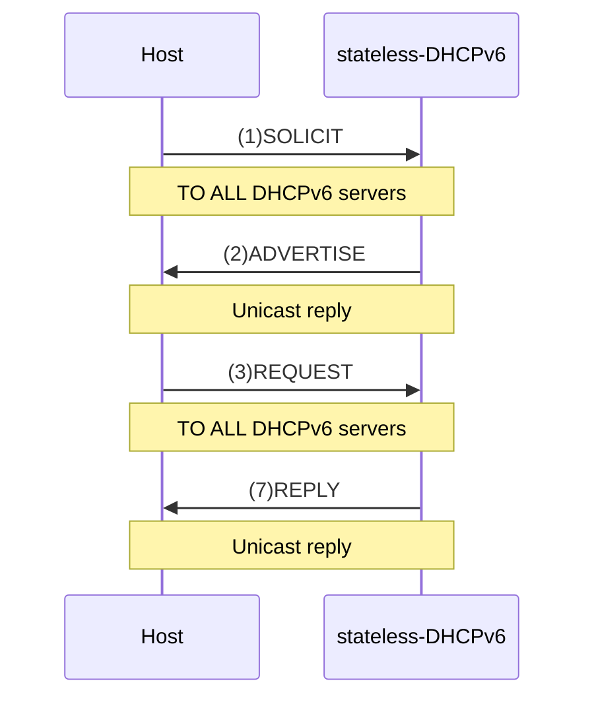
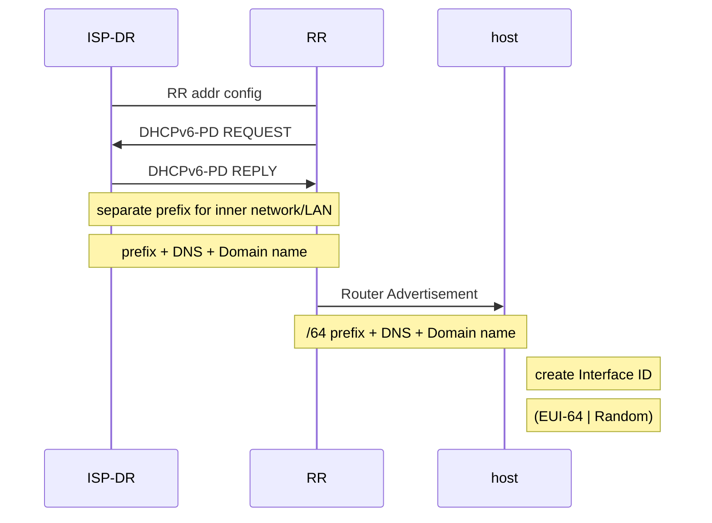

# ICMPv6

> - `error reporting` and `diagnostic functions`
> - messages may be calssified as `error ms`(0-127) or `information ms`(128-255)
> - type of ICMPv6 packet is defined in the `type` field 
> - `code` field provides additional information
> - `format` may change based on type of packet

(NDP) `uses five ICMPv6 packets `to performs its functions`(133-137)`

> -	[(ICMPv6) Parameters](https://www.iana.org/assignments/icmpv6-parameters/icmpv6-parameters.xhtml)
> - [RFC 4443](https://datatracker.ietf.org/doc/html/rfc4443)
> - [wiki](https://en.wikipedia.org/wiki/Internet_Control_Message_Protocol_for_IPv6)

# IPv6 Dynamic Address Configuration

## Neighbour Discovery Protocol(NDP)

>([Wiki](https://en.wikipedia.org/wiki/Neighbor_Discovery_Protocol)) Its a *Link Layer Protocol* and it defines five pakets types(13x) used for:

### IPv6 Address Resolution (IPv4 ARP):

given IPv6 address an host want to know the related `mac of its neighbours` and insert it in the Neighbour Cache using:
- (`135`)Neighbour Solicitation Message: Host asking for `Link-Layer Address(MAC)` of another Host; 
	- `Multicast Request` to find out address of new hosts ([to solicited node](https://en.wikipedia.org/wiki/Solicited-node_multicast_address)):
		- host subscribe to *multicast Group* that correspond to its MAC
		- every time someone wants to reach him they just send a Neighbour Sollicitation to its Multicast Group 
	- `Unicast Request` just to verify if host is reachable or not
- (`136`)Neighbour Advertisement Message: answer to Neighbour Sollicitation message

> When a host connects to a new network, It sends a `Neighbour Solicitation` with multicast destination

Respectively in IPv4 we have:
- ARP Request/Reply messages
- IPv4 uses `Ethernet Broadcast Message` instead of `IPv6 Multicast`
- more efficient => *no broadcast over ethernet* + Reduce packets

### Dynamic IPv6 Address Allocation:

In order to obtain `IPv6 Address information` an host need to send a Solicitation to the Router and then It will answer will an `available configuration` for that specific network `SLAAC, stateless or stateful`


- (`133`)Router Solicitation Message: Host wants to locate `Routers on attached link` and ask for IPv6 configuration Options available
- (`134`)Router Advertisement Message: Routers `advertise their presence` periodically or as respond to a Router Solicitation message
 
> <b>ONLY local Router decides type of configuration used in the network </b>
 


- (`137`)Redirect message: routers inform hosts of a better first hop router for a destination

for IPv4 hosts:
- DHCP or static allocation 

## Stateless Address Autoconfiguration (SLAAC)


Available configuration for host sent by Router Advertisement message can be:
- OPT1: SLAAC - No DHCPv6(default on Cisco Routers): router gives everything (prefix,Def gateway,DNS...) to the host for create its own address
- OPT2: SLAAC + Stateless DHCPv6 for DNS address: router gives info but DNS addresses can be found only `from DHCPv6`
	- OPT 1-2 are `stateless` configuration, then DHCPv6 does `not maintain state` of addresses
	- No full knowledge of the network state or list of addresses used
- OPT3: All hosts except default Gateway use DHCPv6
	- `stateful`: just ask to an DHCPv6 server all info for IPv6 configuration


### SLAAC - No DHCPv6:

Host want to know IPv6 information for Autoconfiguration OPT1 so it sends a Router Solicitation and local Router answer with
`Option 1 - RA Message`:
```
to: 		FF02::1 all-IPv6 devices (multicast addr)
From:		FE80::1 default Gateway  (Link-Local addr)
Prefix:		2001:DB8:CAFE:1::	 (of this network)
Prefix-length:	/64
+ DNS info
```
Local Host now knows:
```
Network Prefix:	2001:DB8:CAFE:1::
Prefix-len:		/64
ll Def Gateway:	FE80::1
---------------------------------
Global Unicast Address:
2001:DB8:CAFE:1: + Interface ID
```
Now host can compute its Interface ID using either `EUI-64` or `Random 64-bit value` and gain a valid and routable GUA address
- SLAAC + Random 64-bit value can be used as `Privacy extension`:
	- as Temporary IP address (short lifetime)
	- to be `untraceable` in the internet
	- common to have multiple temporary addresses (for new connections)
	- is supported by Win vista and newer + linux

### Duplicate Address Detection(DAD):

> ([link](https://medium.com/networks-security/ipv6-duplicate-address-detection-dad-f83b20cb89aa)|[DAD-attacks](https://journals.plos.org/plosone/article?id=10.1371/journal.pone.0214518#:~:text=Duplicate%20Address%20Detection%20(DAD)%20refers,to%20an%20interface%20%5B13%5D.)) SLAAC is stateless then no entity is maintaining a state of addresses used or any sort of address-to-device mapping

> Then how can we guarantee unique addresses? (LL or GUA)

- Used by `every host` with SLAAC
- Used `Before assign` IPv6 address to an interface
- Host send Neighbour Solicitation to the `solicited-node` multicast group :
    - based on the IPv6 Address `it plans to assign using SLAAC` OPT 1,2
    	- if someone respond ==> It's a Duplicate!
    	- If no one respond ==> Unique Address!!

> ([Switch-Wiki](https://techhub.hpe.com/eginfolib/networking/docs/switches/WB/16-01/5200-0135_wb_2920_ipv6/content/ch01s11.html)) with Cisco switches if DAD service is active in order to check what addresses they are using or not :

- the cisco Switch will send a Neighbour Solicitation to the All-Nodes multicast address `(ff02::1)` and retrieve every *link-local* address in use


### SLAAC + Stateless DHCPv6:

In this case host *has its own address(stateless)* and *default gateway* but it needs a DNS server. 
Then Host will send a Router Solicitation and Local Router will respond with `Option 2 - RA Message`:
```
to: 		FF02::1 all-IPv6 devices (multicast addr)
From:		FE80::1 default Gateway  (Link-Local addr)
Prefix:		2001:DB8:CAFE:1::	 (of this network)
Prefix-length:	/64
---------------------------------
Managed address configuration flag == 0
Other configuration flag 	   == 1
```
Now host after generate Interface ID will contact DHCP server `for DNS addresses`

> ([wiki](https://en.wikipedia.org/wiki/DHCPv6)) not ICMPv6 but `DHCPv6 Message type`  ([RFC 8415](https://datatracker.ietf.org/doc/html/rfc8415))




```
<--- SOLICIT (to all DHCPv6 servers)
ADVERTISE (unicast) -->
<--- INFORMATION REQUEST (to all DHCPv6 servers)
REPLY (unicast) -->
---------------------------------
DNS: 2001:DB8:CAFE:1::99
Domain Name: cafe.com
```
### Stateful DHCPv6:

In this case host is *only* using the *default Gateway address* from RA and it need to contact a stateful DHCPv6 server for all IPv6 Information. Local Router will respond with `Option 3 - RA Message`:
```
... as OPT 2 ...
---------------------------------
Managed address configuration flag == 1
Other configuration flag 	   == 0
```
Now host will contact DHCP server for GUA,DNS addr and `all IPv6 Informations`
```
... as OPT 2 ...
```

## DHCPv6 Prefix Delegation Process

> ([RFC8415](https://datatracker.ietf.org/doc/html/rfc8415)|[RFC3633]([RFC8415](https://datatracker.ietf.org/doc/html/rfc8415))) Way to acquire from ISP a prefix for your network

- IPv6 has *complete Reachability (ISP Delegation Router-to-host)* 
- elements involved are: `ISP Delegation Router (ISP-DR)` + `Requesting Router (RR)` + `host`
- RR requests, as any other client, an IPv6 address for `its ISP's facing interface` from ISP-DR (OPT 1,2,3)
- After external interface of RR is ready then the Prefix Delegation Process Starts:

> [wiki???](https://en.wikipedia.org/wiki/Prefix_delegation) what types of pachets???



- for DHCPv4 ISP-DR :
  - ISP deliver `public IPv4` address to home router
  - DHCPv4 + [RFC1918](https://datatracker.ietf.org/doc/html/rfc1918) allocate private address for private network
  - `NAT` is used for translation