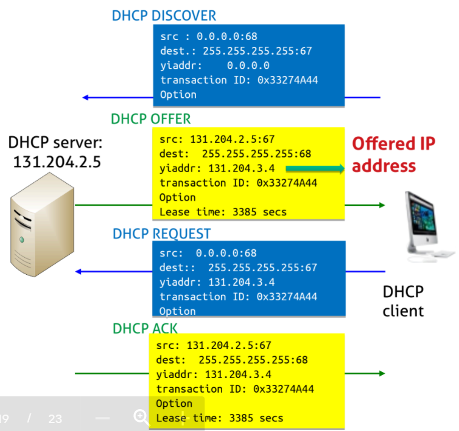
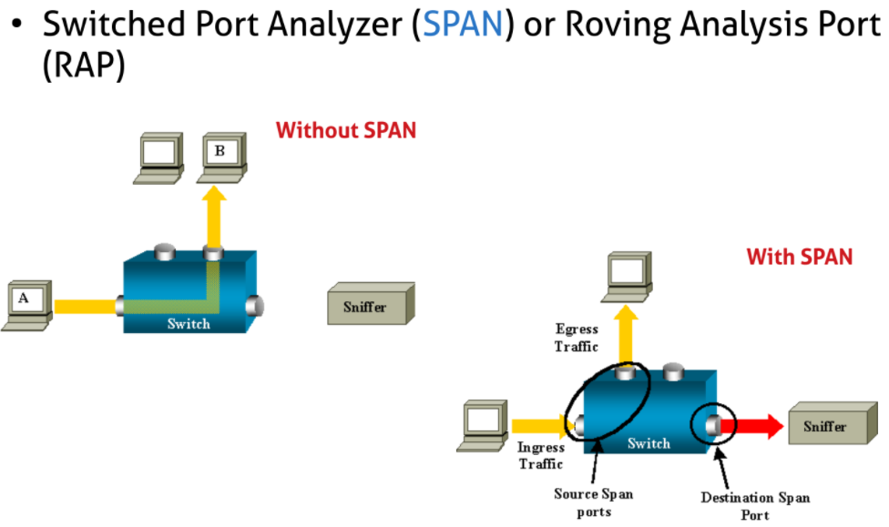

# Network setup

## IProute2

> ([iproute2 Howto Wiki](http://www.policyrouting.org/iproute2.doc.html)) offers complete low-level network configuration 

| command | description | 
| --| --|
|ip link \ ip l  | show physical interfaces  |
|ip link set ethx address a:b:c:d:e:f  | set MAC address |
|ip link set ethx [up\down]  | plug-unplug cable  |  			    
|ip addr \ ip a show [dev ethx]  | show ip address  | 
|ip addr [add\del] a.b.c.d/m dev ethx  | add/remove ip address |			    
|ip addr flush [dev ethx]  | **destroy interface** and remove any assigned address |
|ip addr replace a.b.c.d/m dev ethx  | instead of flush+add during startup   |
|ip route \ ip r [list\flush]  | list\flush routing table |	 
|ip route [add\del] a.b.c.d/m via [next_hop]  | add/del route by next hop|			    
|ip route [add\del] default via a.b.c.d  | add/del default route|
|watch ip r  | real-time populated routing table     |
|ip route [add\del] a.b.c.d/m dev ethx  | Direct forwarding |
|ip neigh [flush\show] dev ethx  | show/flush ARP table |

> [ifconfig man page](https://man7.org/linux/man-pages/man8/ifconfig.8.html) - [examples](https://www.tecmint.com/ifconfig-command-examples/)

| ifconfig commands  | for legacy systems     |
| -- |-- |
| ifconfig (-a) [ethx]  | display all active interfaces and details |
|ifconfig \ [ifup\ifdown] ethx  [up\down]  | enable\disable ethx   |	
|ifconfig ethx a.b.c.d netmask A.B.C.D broadcast e.f.g.h  | config IP of ethx interface |    
| ifconfig ethx hw ether AA:BB:CC:DD:EE:FF  | change MAC address |
| route add default gw a.b.c.d  | set default route gateway  |

> [route man page](https://man7.org/linux/man-pages/man8/route.8.html)

## kathara files

> - /shared.startup (shell commands for all vm inside kathara lab)
> - /vm.startup (booting command for specific vm)
> - /lab.conf (physical topology and collision domain definition)
> - /vm/etc/network/interfaces (network interfaces file for static IP config)
> - /etc/resolv.conf (contains DNS IP addresses)

## How configure topology of networks

> [Debian Network Setup](https://www.debian.org/doc/manuals/debian-reference/ch05.en.html)

- In order to `properly` use Internet an Host has to receive `4 main pieces` on information:
  - The IP address
  - The netmask (defines Network/host portion of IP address)
  - The IP address of its Default Gateway (device in local network `able to access` the Distribution layer)
  - The IP address of a DNS (a remote server `able to translate` human intelligible names to IP addresses)
  - definition of MTU :
```bash
      sudo ip link set eth0 mtu 1400 
      ifconfig emX mtu 1400
```
> configuration can be `static`: inside */vm/etc/network/interfaces* or at `startup` using *ifconfig* or *iproute2* commands; (ex. on lab1)

## DHCP3 setup

> ([wiki](https://it.wikipedia.org/wiki/Dynamic_Host_Configuration_Protocol)) It's a client-server mechanism implemented by deamon `dhcpd` where the Server has a `pool` of IP addresses to distribute together with the network configuration


>   <p align = "center" > 	<em> DHCP address exchange </em> </p>


>  Clients requesting a new IP address receive a proposal and accept it, once accepted the IP is `reserved` for a "leasing time"

- DHCP procedure uses `udp` protocol on port 67(srv) / 68(client):
  - Host broadcast "DHCP Discover"
  - DHCP Srv. responds with "DHCP offer"
  - Host request IP addr "DHCP request"
  - DHCP Srv. sends addr "DHCP ACKNOWLEDGE"

- udhcp configuration:
  1. install package (*apt install -f udhcpd*) inside startup file 
  2. set up *rx/etc/udhcpd.conf* file as shown here: [udhcp.conf-syntax](https://udhcp.busybox.net/udhcpd.conf)
  3. start daemon (*udhcpd /etc/udhcpd.conf*) inside startup file
  4. set up client:
     -  inside *pcy/etc/network/interfaces* file: *iface ethx inet dhcp*
     -  (*dhclient ethx*) inside startup file

## Host Connection Script

> how connect `host machine` to `VM` (guest machine)?

> after starting the lab we need to link one collision domain(local net) to a `virtual interface` ($veth_x\ veth_y$)

> we need to find the `docker image` related to the `collision domain` we want to connect : there exists `one for each network` with the same name as defined in the `.lab file`
```bash
sudo ip link del veth1 type veth
sudo ip link add veth1 type veth
sudo ip addr flush veth0
sudo ip addr add [addr/x] dev veth0

# find docker image of local network
sudo docker network list | grep kathara_[user]-xxxx_[lan]
                         | grep kathara_xxx

#bridge = xxx
brctl show | grep -o 'kt-[a-z0-9]'  # find right virtual-bridge to connect

sudo ip link set veth1 master kt-xxxx                        

sudo ip link set veth0 up
sudo ip link set veth1 up

ip addr show dev veth1
ip addr show dev veth1
```
```bash
# on host machine ---listening on veth1
~$ tcpdump -ni veth1  

# host already has IPv6 scope address (by default...)
~$ ping fe80::101%veth0 # (only local lan)

# ---speaking through veth0
~$ sudo ip addr add [IPv6Addr/64] dev veth0
ping -I veth0 2001:db8:cafe:2::10x  # (all lab is reachable)

it works...
./connect-lab .sh (a .b. c.d /x) ( lan_name ) # connect to broadcast domain with given IP address
```

## Network Traffic Monitoring

> Packets flow in the network, to capture them use a `network traffic dump tool` like:

- dumpcap/wireshark/tcpdump
-  wireshark and tcpdump can `visualize, save and analyze captured packets`
-  [Promiscuous/monitor mode](https://en.wikipedia.org/wiki/Promiscuous_mode): NIC/WNIC pass all the observable traffic without discrimination to the CPU
- Capturing all the packets can be messy:`use filters!` to focus on specific packets, connection or activity patterns
- `Display filters`: inspect only packets you want to analyse and display packets `matching the filters`, packets are `not discarded or lost` (wireshark)
- `Capture filters`: Limit the traffic captured and analysed. packets not captured `are lost!`(tcpdump)

### How capture Network traffic?

- Promiscuous mode (can be limited by switches)
- Physical tap interface (directly to LAN cable)
- Port mirroring on a managed switch:
  - Usually only destination port receive packets:`SPAN` send all traffic to switch `analyser/sniffer`
- Aggressive approaches for sniffing:
  - ARP cache poisoning (spoofing):steal IP addresses using Unsolicited ARP replies ([ettercap](https://www.ettercap-project.org/),cain¿abel)
  - MAC flooding: fill the CAM Table of switch to make it acting as a hub (macof)
  - DHCP redirection: steal(exhausts) IP addresses from the pool, then pretend to be the default GW with new DHCP requests
  - redirection and interception of ICMP packets


> <p align = "center" > 	<em> SPAN-RAP </em> </p>


### How prevent packet capture?

> methods implemented in switches

- `Dynamic address inspection(DAI)`: validates APR packets
- `IP-to-MAC address binding inspection`: drop invalid packets
- `DHCP snooping`: distinguish between trusted and untrusted ports and uses a `database` of IP-to-MAC;
  - ports that show rogue activity can be `automatically disabled`

## Packet inspection with tcpdump

> Dummy example: we connect Host machine using script, then we use `netcat` to create a UDP/TCP connection between 2 host and capture traffic with [tcpdump](https://www.tcpdump.org/manpages/tcpdump.1.html) finally visualize it on host machine with wireshark(file.pcap)

|netcat | . | 
|--|--|
|nc (-u) [ip-addr] [port] | TCP/UDP connection through port |
|nc (-u) -l -p [port] | Listen on port |

> when capturing on vm remember to save file.pcap on */shared* folder 

| tcpdump(on listener Host) | ([tcpdump-manPage](https://www.tcpdump.org/manpages/tcpdump.1.html)) |
|--|--|
| (ctrl+z) + | (bg) |
| tcpdump -ni [ethx/any] -w /shared/file.pcap | (-n) not resolve DNS (-i) define interface (-w) write on |
|... udp port 53|capture DNS queries|

|ports check |([ss-guide](https://phoenixnap.com/kb/ss-command#)) |
|--|--|
|ss -a| display all listening and non-listening connections|
|ss (-l) (-p/u)|only listening sockets + TCP/UDP connections|
|ss dst (addr) |connections to a specific destination |
|ss (options) dst :(port number or name)|for a specific destination port number or port name|
| (-l) listening sockets (-u -t -x) udp,tcp,unix | . |
| lsof -P -n -i(IPv4) | info about files opened by proceses |
| netstat | connections states with localhost |
| (-ltn) listening,tcp,no resolve | | 

## Network Manager
> [NetworkManager_Guide](https://developer-old.gnome.org/NetworkManager/stable/nmcli.html)

|nmcli ||
|--|--|
|nmcli device show [ethx] | show interface main info|

## shared folder

> how `enable` hostHome folder?  \
> *home/user/.conf/kathara.conf* \
>  "hosthome_mount" : true --> `shared` folder will be availabe for exchange of files...

# Lab1 Activity 

### ex1 

> GOAL: Manually configure pc1-3 in order to be in the same network than r1 as 192.168.100.30/29

- Configure pc1 using the `interface` file; pc2 using iproute2; pc3 using ifconfig (on startup files)
- add DNS server + default gateway as r1 + verify connectivity within network and internet

### ex2

> GOAL: Configure r1,pc1,pc2 in order to receive their networking configuration from a DHCP server(r1);
DNS is the server used by host machine; gw and DHCP server is r1 using udhcpd (apt install udhcpd)

- configure pc1 using `interface` file and pc2 using `dhclient` command (on shell after startup)

### ex3

> GOAL: assign IP addresses + configure the network in order to be reachable and assign subnetworks
using address:172.16.0.0/16

- The address can be split in 3 subnetworks of `6 hosts and 3bits each:`
	- 172.16.0.0/29 .0->.7 (lan1)
	- 172.16.0.8/29 .8->.15 (lan2)
	- 172.16.0.0/29 .16->.23 (internal)
	
### ex4

> Activity1: Connect to the kathara lab, get http page and capture packets using

1. *./connect-lab.sh 10.0.0.x/24*
2. *tcpdump -ni any -w /shared/capture.pcap* (on pc1)
3. wget http://10.0.0.1/da|ba.php (on host machine)
4. analyse and compare files with wireshark

> Activity2: Connect to open ftp/sftp server and use filters to search for user/password

1. *tcpdump -ni any -w capture.pcap*
2. *ftp test.rebex.net* (demo:password)
3. *sftp demo@test.rebex.net* (demo:password)
4. analyse -> sftp is encrypted!!
