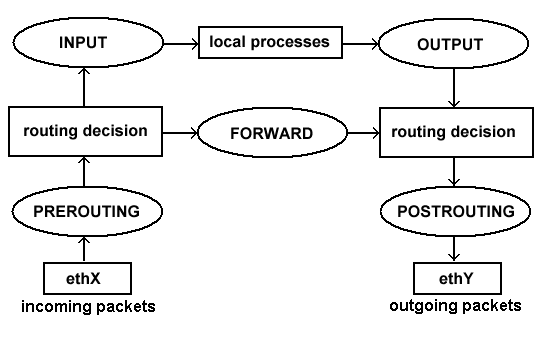

# Iptables Fundamentals
- [Netfilter](https://it.wikipedia.org/wiki/Netfilter) : linux kernel framework that provides hook handling for intercepting & manipulating network packets
- [Hooks](https://en.wikipedia.org/wiki/Hooking) : entities (like modules) that allow packets `manipulation` during their traversing
  -  when intercepted by there hooks the IP packet is verified against a given set of `matching rules` and processed by an `action` configured by the user  
- [Iptables](https://www.frozentux.net/iptables-tutorial/iptables-tutorial.html): Userspace level configurator 
  - *order of matching rules is important*
  - packets fates depend on the *first matching rule*
  - If no match the *default policy will be applied*
  - every chain has its *default policy* 
- [Iptables_book](https://book.huihoo.com/iptables-tutorial/book1.htm)

 
> ***TABLES** (operation over a packet) as set of **CHAINS** (how packets are elaborated)(queues) as set of **RULES**(match+action);*

## built-in tables 

each table defines a different kind of operation that can be perform over the packets 

- **filter** => filtering of packets : allow or block packets (accept/drop), every packet pass through this table
  - (INPUT / OUTPUT / FORWARD)
- **nat** => address-port translation (SNAT/DNAT/MASQUERADE) : the first packet of a connection pass through this table then its result define behavior of next packets belonging to the same connection
  - (PRE_ROUTING / POST_ROUTING / OUTPUT)
- **mangle** => packet header modification (QoS), every packet pass through this table and contain all predefined chains
  - (PRE_ROUTING / POST_ROUTING / INPUT / OUTPUT / FORWARD )
- **raw** => avoid connection tracking
  - (PRE_ROUTING / OUTPUT)

## built-in chains

>   

Every packet pass through a set of hook-chains of multiple tables, each rule inside tables check a match. If match, other rules will be ignored


>   

## Iptables Flow

- local generated packets : 
  - Local Process -> OUTPUT -> POST_ROUTING -> NET
- Forwarded Packets :
  -  NET -> PRE_ROUTING -> FORWARD -> POST_ROUTING -> NET 
- Locally Addressed packets :
  -  NET -> PRE_ROUTING -> INPUT -> Local Process

## build-in rules

> <center>[Match + target]</center>
- **Match** : specification of the packet processed, a `special condition` within the packet that must be true (or false)
  - [GENERIC_mtc](https://www.frozentux.net/iptables-tutorial/iptables-tutorial.html#GENERICMATCHES) : always available, *whatever* the protocol or extension we are working on
  - [IMPLICIT_mtc](https://www.frozentux.net/iptables-tutorial/iptables-tutorial.html#IMPLICITMATCHES) : three types of implicit matches for three different protocols(TCP\UDP\ICMP). These are **unique criteria** available only for those protocol packets 
    - ... -p --protocol *tcp | udp | icmp* [imp_mtc] ...
  - [EXPLICIT_mtc](https://www.frozentux.net/iptables-tutorial/iptables-tutorial.html#EXPLICITMATCHES) : have to be specifically loaded with the **-m or --match** option as extension module 
    - ... -m *addrtype | state | multiport | conntrack* [exp_mtc]... 
- **Target** : how manipulate the packet matching the rule, what Action to perform 

|**Target**|*how manipulate the packet matching the rule : what Action to perform*|
|--|--|
|ACCEPT| result depends on the current chain in the current table|
  | DROP | delete without sent back NACK |
  | QUEUE |  send packets to upper layers programs and applications|
  | RETURN | packet go to default policy of current chain, if sub-chain then travel through superior chain
  | REJECT | equal to DROP + send back ICMP error (**only** for filter table and its chains) 
  | LOG | logging packets, debugging of rules if used instead of DROP ([syslogd](https://linux.die.net/man/8/syslogd))
  | DNAT | override IP destination address of packet and *all subsequent packets in the same stream* (**only** for NAT table and PRE_ROUTING + OUTPUT chains) 
  | SNAT | (--to-source) override IP source address of packet, used when multiple hosts share same Public IP Address (**only** for NAT table and POST_ROUTING chain)
  | MASQUERADE | as SNAT but for dynamically assigned IP connections, *we set the IP address used on a specific network interface instead of the (--to-source) option* (**only** for NAT table and POST_ROUTING chain)
  | ... | [other_TARGETS](https://www.frozentux.net/iptables-tutorial/iptables-tutorial.html#TARGETS)

# Stateful packet filtering 

## Connection Tracking machine 
> [The state machine](https://www.frozentux.net/iptables-tutorial/iptables-tutorial.html#STATEMACHINE) is the name of the *connection tracking machine* inside Netfilter framework. Used **to know the state of a specific connection**

- Firewalls implementing this are **stateful** :
  - packets can be related (group by) to their connection so it's possible to define rules based on the common relation of packets
  - NAT table use this info to apply action at packets of the same connection
- packets are related to tracked connections in [*user-land states*](https://book.huihoo.com/iptables-tutorial/x4342.htm) with *state match extension* :
  - Flows : [TCP](https://book.huihoo.com/iptables-tutorial/x4436.htm) - [UDP](https://book.huihoo.com/iptables-tutorial/x4596.htm) - [ICMP](https://book.huihoo.com/iptables-tutorial/x4634.htm)
  - **-m state --state [s]** 

|"s"|packet is ...|
|--|--|
|NEW |start of a new\un-established connection|
|ESTABLISHED |part of a connection already registered in the kernel or established |
|RELATED|start of new connection created by an older established one |
| INVALID| can't be identified or that it does not have any state(ALWAYS DROP) |
| UNTRACKED | marked within the RAW table with the NOTRACK target | 
  
- [Conntrack match](https://book.huihoo.com/iptables-tutorial/x6330.htm#CONNTRACKMATCH) is an extended version of the state match 
  - **-m conntrack [option]**
- [*/proc/net/ip_conntrack*](https://book.huihoo.com/iptables-tutorial/x4273.htm) : list of current entries in conntrack database, all info maintained by the module **to know in which state a specific connection is**

# Commands & Syntax
> *$ iptables <span style="color:red"> [command] [chain] </span> [table] <span style="color:blue">[match]</span>
<span style="color:green">[target/jump]</span>*
> - $ iptables <span style="color:red"> -A POSTROUTING </span> -t nat <span style="color:blue">-o eth0 </span> <span style="color:green">-j MASQUERADE </span>

- tables -> chains -> rules -> target -> action || jump to  different chain
- default table --> filter table  
- tables as small letters // chains as CAPITAL LETTERS
- commands as CAPITAL LETTERS // option as small letters

|-L --list options | --  | 
|--|--|
|-v | verbose|
|-n | numerical values, no name resolv |
|--line-numbers | show rule number|
|**[Cmds+Options_tutorial](https://book.huihoo.com/iptables-tutorial/x5245.htm)**|**[Jump to other Chains_example](https://www.frozentux.net/iptables-tutorial/chunkyhtml/c3965.html)**|

```bash
rule -> [match] + -j [target]

# append / delete / insert / replace rules
iptables [-t table] {-A | -D} chain rule
iptables [-t table] -D chain rule_number
iptables [-t table] -I chain [rule_number] rule
iptables [-t table] -R chain rule_number rule

# list / flush rules
iptables -L -n -v --line-numbers
iptables [-t table] {-L|-F} chain

# set policy / new / delete(empty-ONLY) / rename chain
iptables [-t table] -P chain new_policy_target
iptables [-t table] {-N|-X} chain
iptables [-t table] -E old_chain new_chain_name
```
## common switches

|Useful iptables|command switches|
|--|--|
-t table |Specifies the table (filter if not given)
-j target |Jump to the target (it can be another chain)
-A chain |Append a rule to the specified chain
-p --protocol [prt] | Match the protocol type
-s --src [ip-address] |Match the source IP address
-d --dst [ip-address] |Match the destination IP address
-i --in-interface [eth-name] |Match input interface (from which the packet enters)
-o --out-interface [eth-name] |Match output interface (on which the packet exits)
! (==not) |Used to negate the match. Can be used with many flags, Example: all the source addresses but a specific one **-s ! ip_address**
-f |Match fragments which are not the first of a packet

|--|--|
|--|--|
-p tcp --sport port |Match the tcp source port
-p tcp --dport port |Match the tcp destination port
-p udp --sport port |Match the udp source port
-p udp --dport port |Match the udp destination port
--icmp-type type |Match specific ICMP [packet types](https://book.huihoo.com/iptables-tutorial/a12854.htm)
-m module |Uses an extension module
-m state --state s |Enable **connection tracking**, Match a packet which is in a specific state
-p [ptc] -m multiport --xport port | Enable specification of several ports with one single rule

|--|--|
|--|--|
--syn |Match packets which start a TCP connection, It is equivalent to --tcp-flags SYN,RST,ACK SYN
-n |Used to avoid name substitution for IP hosts and port
-m conntrack -ctstate... | Enable connection tracking (superset of state)
-m mac --mac-source |Match packets with a specific source MAC address
-m limit |Limit the number of packets for a specific time period (--limit and --limit-burst) **iptables -A FORWARD -p tcp --syn -m limit --limit 1/s -j ACCEPT**

## create,save rule_set
- `iptables_rules.sh`
```bash 
#!/bin/bash
# flush (clean) the filter table
iptables -t filter -F
# allow only service XX
iptables ...
------------------------
# built-in commands (we use legacy iptables)
iptables-legacy-save > iptables_rules.sh
iptables-legacy-restore < iptables_rules.sh
```

# Lab Activity

## EX1,2

```bash
tutti IPv4 ; 
s1 ->  webserver

echo 2001:db8:cafe:2::80/64 s1 >>/etc/hosts  ## posso aggiungere  alle VM e pingare direttamente l'host name

collegandomi posso pingare dentro con 
>> ping ----- -I veth0
+ sudo ip route add 192.168.100.0/24 via 192.168.10.1 
per poter fare wget in tranquillità


+ echo 192.168.100.80 s1 >> /etc/hosts  ---> utile soprattutto per il router se devo fare tcpdump -i ethx
anche SSH funziona da esterno !!!
```

## ex1,2

> block SSH traffic from outside  :  " only allow HTTP traffic to s1"   + do the same in ipv6
```bash
#creare sotto catena di filter : if destinatio is s1 then JUMP to subchain:
# here :: policy is DROP|REJECT   
#  +  only allow HTTP traffic TO s1 :

iptables -N S1_fiter
iptables -A FORWARD -i eth0(external) --dst s1 -j S1_filter
# sub chain  rules 
iptables -P S1_fiter DROP ## POLICY TAKE ONLY DROP-ACCEPT
# allow only HTTP traffic to s1 
iptables -A S1_filter -p tcp --dport (80-8080) -j ACCEPT


## non funziona : continua ad accettare tutti gli altri servizi. non manda ICMP REJECT packet.  xche?? su che chain vengono accettati ??? 
```