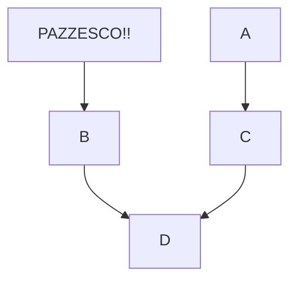

# PND_Notes
Notes and Laboratories from Practical Network Defense Course of Master Degree in Cybersecurity
---- devono essere tutti file.md


Mark *italic text* with one asterisk, **bold text** with two.
For ``monospaced text``, use two "backquotes" instead

## equations


# Docs

go to github docs and `writing on github` section 
## add link
and other text [text visualize for linkk](https://www.ultimate-guitar.com/) and other text

## add images

[this is an image](https://drive.google.com/file/d/1QO-aMwzg7TOLzCQkyLVu84h191-3vGf4/view?usp=sharing)
insomma come va?
## drag and drop Image adding + centered images
<p align ="center">

 
 *image caption*
<br />

</p>
linea con a capo usando una riga vuota

a capo con una riga vuota


## new line command 
first
<br />
second

-       -frasi o comandi sicngoli che possono essere copiati ( no multiriga)

```
 function code block
 secondo code  devo usare un elemento particolare `....`  (si multiriga)
```

## creare diagrammi



## creare tabelle

| First Header  | Second Header |
| ------------- | ------------- |
| Content Cell  | Content Cell  |
| Content Cell  | Content Cell  |

è meglio di Latex?
 - intanto ho sempre tutto online
 - tutti possono correggermi ed usarla
 - è più future proof
 - forse è più facile l'indentazione
 - è più facile inserire codice dai Laoratori xche 
 -    - non devo scrivere il tree
 -     - non devo scrivere codice, basta copiarlo in toto
 - i link pesno che funzionano
 - ho un indice gestito meglio

- ho solo un appunto sulle foto usate. non sò se possono essere utilizzate e se mi danno noie come su latex
- di sicuro ho la Preview diretta

- posso creare un file o documento per ogni topics specifica
- IPv6 folder (sections )
-   - files ( subsections )
-   -  dentro i file solo paragrafi
-   -  e poi tutto il resto che trovo


