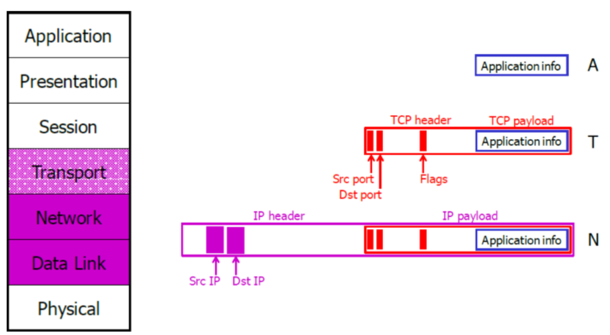

# Network Traffic Regulation

> [o'reilly_Building_Internet_Firewalls](http://litux.nl/Books/books/www.leothreads.com/e-book/oreillybookself/tcpip/firewall/index.htm)

## Security Design Elements 

- The weakest link : security of system is as strong as its weakest point
- Choke points : structure the network as the only way to reach a certain area is through a `specific Access Point`
- Defense-in-depth: *multiple overlapping* security systems running on the same network (`nested security`):
  - add security redundancy + remove single point of failure
  - attacker has to find `multiple vulnerabilities` in different components
- [Universal participation](http://litux.nl/Books/books/www.leothreads.com/e-book/oreillybookself/tcpip/firewall/ch03_06.htm) : absence of active opposition to the security approach implemented in the network + presence of active participation from users
- diversity of defense : use different type of security mechanisms

> Routers are meant to `make the traffic flow`. However, we can introduce some `decisions, rules, permissions` before allowing a packet to flow between networks through `firewalls`

- Least privilege: giving the permissions to perform an action  `at most` and no extra rights
- [Fail-Safe Stance](https://docstore.mik.ua/orelly/networking_2ndEd/fire/ch03_05.htm) : if anything goes wrong, lets be sure that the system will `fail safe` : 
  - *The default deny stance* Specify only what you allow and prohibit everything else. 
  - *The default permit stance* Specify only what you prohibit and allow everything else.
   
## Types of Firewalls

[`Firewall`](https://en.wikipedia.org/wiki/Firewall_(computing)): device that beside acting as a router define rules for `implement a security policy`:
- regulate `allowed traffic` with firewalls by filtering : packets, source, destination, services, connections ...
- Monitor hosts and traffic for `bad behaviour` : [intrusion detection systems](https://en.wikipedia.org/wiki/Intrusion_detection_system)
- Protect traffic by `encryption` : VPN, SSL, TSL, HTTPS...
- Simplicity : Make it simple!!
  
### Types by Role in the network:
 
> different types on firewalls have different **Roles** base on the type of **traffic** they screen and **where** they are placed in the network

- Host based packet filter :
  - ROLE : single-host filtering of packets 
  - TRAFFIC : in\out a single host ONLY + work per-app (each application has its known policy that has to obey)
  - WHERE : in personal machine of network's hosts
- Screening Router ([ACL-based](http://www.di-srv.unisa.it/~ads/corso-security/www/CORSO-0203/Cisco/cisco827_htm/cisco827_acl_std.htm)) :
  - ROLE : all Network filtering of packets by site's security policy
  - TRAFFIC : all Network flow + ONLY packets not meant for him (FORWARD IpTables chain)
  - WHERE : edge Routers 
> [Network Access Control Lists](https://en.wikipedia.org/wiki/Access-control_list#Networking_ACLs) : 
> - List of rights\rules applied to interface,ports and IPaddr
> - `Stateless` : every packet is treated independently (*no knowledge - no memory*)
> - distinguish between incoming-outgoing traffic per interface\port number
- [Bastion Host](https://en.wikipedia.org/wiki/Bastion_host):  
  - ROLE : App. proxy Server + VPN Server + Honeypot ...
  - TRAFFIC : all Network flow 
  - WHERE : edge of Network + DMZ
    + `more regulating features than router`
> `Hardening` is the task of reducing or removing vulnerabilities in a computer system:
> - Shut down unused\dangerous services
> - Strict access and configurations to vital files
> - Remove unnecessary accounts and permissions

> `Dual-homed` : when we have 2 interfaces `physically dividing` the internal from the external network

### Stateless Packet filters:

- `filter` ingoing\outgoing traffic between internal network(or pc) and the internet : **Packet Filters**

- Operate on Transport, Network and Data link Layers 

  

- `STATELESS` firewall: 
  - Drop packets based on its fields ONLY (source,dest,port number,flags...)
  - **no context, only content**

- `Disadvantages` of Packet Filters:
    - small number of parameters : rules are too specific or too general
    - payload of TCP packets is not inspected : no protection against `upper-layer vulnerability`
    - No Authentication facilities
    - no protections against `TCP/IP vulnerabilities`
    - [IP abnormal fragmentation](https://www.imperva.com/learn/ddos/ip-fragmentation-attack-teardrop/#:~:text=IP%20fragmentation%20attacks%20are%20a,by%20exploiting%20datagram%20fragmentation%20mechanisms.)
    
### Stateful Packet inspection:

- `STATEFUL` firewall:
  - Keeps track of `established connections`
  - Can drop packets based on their source or destination
IP addresses, port numbers and possibly `connection states flags` 
> Connection Tracking : [TCP Finite State Machine](http://tcpipguide.com/free/t_TCPOperationalOverviewandtheTCPFiniteStateMachineF-2.htm)

### Other Types of firewalls:

- Application-Level filtering : apply specific mechanism for each application : `intelligent filtering`
  - +support user-to-gateway authentication
  - +can log + audit all activity
  - -Big overhead
  - -App specific
  - -not always transparent
- Circuit-Level gateways : `TCP relay` or `Generic Proxy`
  - Splices and relays TCP connections
  - SOCKS performs at layer 5 of OSI model : `Session Layer`
  - does not examine contents of TCP segments
  - Less control that App-lv gateway
- Next-Gen Firewalls : 
  - Intrusion Detection Systems + VPN GW + Deep packet inspections + Traffic shaping
  
### Firewall modes:

- Routed mode : 
  - firewall is hop in the routing process
  - Divide different logical networks (layer 3)
- Transparent mode :
  - works with data at layer 2

### Common firewall weaknesses: 
  - no content inspection $\rightarrow$ Sw and Protocol weakness
  - no defense against DOS + Insider attacks
  - Firewall failure has to be prevent : cluster for redundancy
  
## Demilitarized zone - DMZ

- `neutral zone` between private network and outside public network 
- `secure segregation` of private network from the one that hosts services for external users, visitors and company's partners
- `regulate access` to internal components of the IT system 

### DMZ cases

> Implementation of **defense-in-Depth** approach to security
- DMZ as screened Host : 
  - Screening router $\rightarrow$ redirect all traffic to Bastion Host
  - Bastion Host $\rightarrow$ make decisions over traffic flow directed to the network
    - dual\single homed Host
- Screened Subnet :
  - External Router + Internal Router
  - Bastion Host 
  - ***split DMZ*** : `multiple nested layers` of DMZ with different services, permissions ...
- Segmented Network :
  - one Firewall segmenting network in more pieces
  - like start topology
  - **a lot of complexity to manage** : not easy
  
# Filter Rules for network firewalls

- Assumptions:
   1. `Security policy` stating what is allowed and not is given
   2. `we can Identify` the good and bad traffic by packet's fields and flags
   3. Firewall is `immune to` penetration
- general mechanism:
  - Rules are checked on **top-down** approach
  - the first matching rule is applied 
  - One default rule is assumed if no rules matches (block\allow everything)
- Three-step process:
    1. Know your policy
    2. Translate the policy in a formal language
    3. Rewrite the policy in terms of the firewall syntax
- **egress filtering** : monitoring and potentially restricting the flow of information outbound from one network to another
- **ingress filtering** : ensure that incoming packets are actually from the networks from which they claim to originate : `to avoid address spoofing`

|#|comment| IPsrc | IPdst |srcPort| dstPort |proto| flag  | Action |
|--| --| --| --| --| --| -- | --| --|

