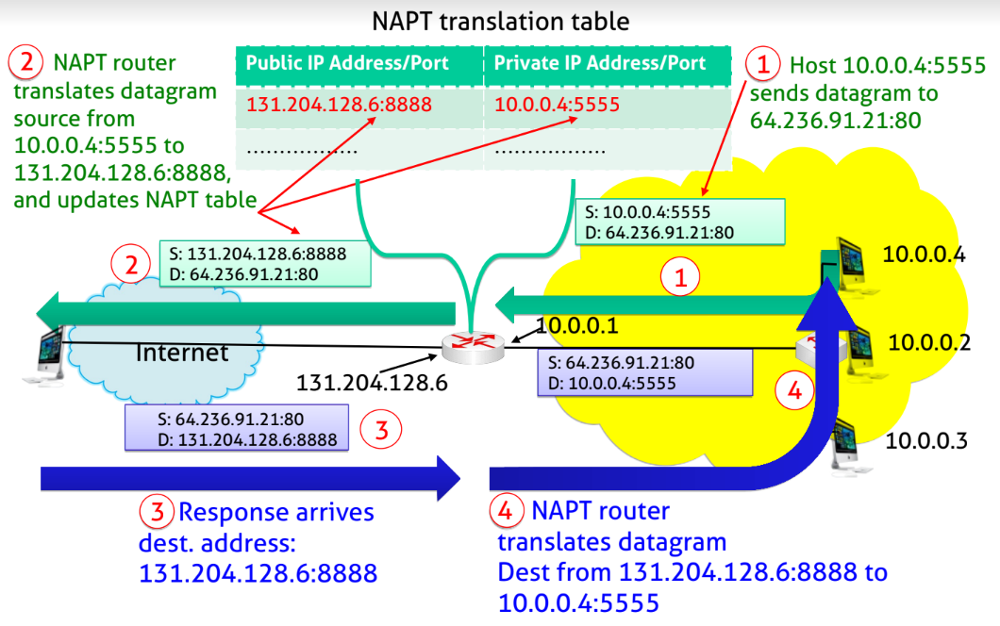
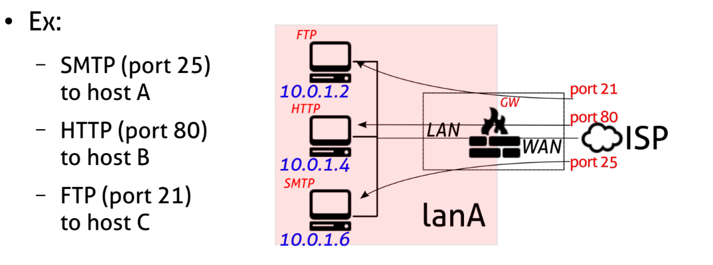
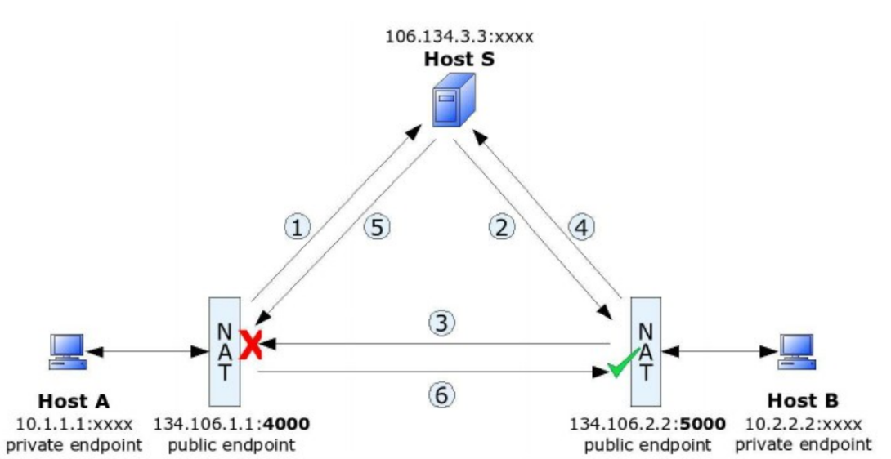

# Network Address Translation - NAT

> [NAT_wiki](https://it.wikipedia.org/wiki/Network_address_translation)

    Basic NAT : translate IP addresses of hosts within a private domain as they communicate with external domain + change IP headers, fields and checksum

- NAT in general is **NOT a SECURITY FEATURE** 
  - unless you use NAPT with drop policy
- IPv6 reach ability is **NOT a DOWNSIDE** because a good firewall policy can make the internal network secure
- A private network uses just **one Public IP address** provided by ISP to connect to the Internet
- NAT Goals :
  - Does not provide security
  - Does not expose Private Hosts outside
    - Devices inside private network are **not explicitly addressable** by external network, or visible by outside world 
  - Allow change of Host's Addresses in private Network without notifying outside world
  - Allow change of ISP without changing the address of devices in private network
> these Goals are Overcome by IPv6 : now they are **All Routable Addresses**

## Source NAT (SNAT)

Translate **outgoing** requests : The session is *Masqueraded* as coming from the NATting device 

- Translation reference is kept inside the **NAT Table**
  - The *NAT table* is where associations between **requests :: internal IP addresses** are kept
- every packet **RELATED** to the session will be translated based on that 
- enable the client-server session to continue on **another port**; forwarding any response by the server to the client **(RELATED packet)**

## Network Address Port (NAPT)

Multiple external/public IPv4 are difficult to obtain due to **the shortage of IPv4 addresses**

Therefore, we map multiple private hosts *to one single* external/public IP and We bind connections from different private hosts **to TCP/UDP port numbers** in the NATting device

    NAPT -> Multiplex a number of private hosts into a single external/public IP

    entry ->  [Private IP :: TCP/UDP Port of NATting Device]

> 

- NAPT **blocks all incoming Traffic** by default 
  - If no match exists in the Translation table every packet **is drop**

### Methods to send incoming requests?
- Application level gateways (ALGs) -> proxy like
- Static port forwarding -> Virtual Server / DMZ option Like 
  - redirect traffic directed to a port to internal server 
  - also known as **DNAT**
- Universal plug and play (UPnP) -> register to third party host and use bridge
- Traversal Using Relays around NAT (TURN)

> *NAT and NAPT are used interchangeably in the literature address*

## destination NAT (DNAT)

    Enable servers located inside LAN to be accessed by external clients
    -->
    According to the port accessed from the external interface, the packets can be forwarded towards different internal hosts

- also known as **port forwarding  or Virtual Server**
- change destination IP address
- different binds inside Translation table
  - port accessible from outside :: internal Server ip + its listening Port 

> 

# NAT pros and cons

- The need to establish state before anything gets through
- The expiration of state to stop receiving any packets when finished with a flow
- The ability for nodes to appear to be attached at the edge of the network 
- The ability to have addresses that are not publicly

## Perceived benefits of NAT in IPv4

These are Good Features of NAT 
- Simple Gateway between Internet and Private Network as **chock point**
- Simple Security Due to Stateful Filter Implementation
- User/Application Tracking
- Privacy and Topology Hiding
- Independent Control of Addressing in a Private Network
- Global Address Pool Conservation
- [Multihoming](https://it.wikipedia.org/wiki/Multihoming) and Renumbering with NAT

## RFC 4864

> Perceived **benefits** of NAT in IPv6; same GOAL but **different mechanism in IPv6** 

> [RFC 4864](https://datatracker.ietf.org/doc/html/rfc4864) 

| GOAL | IPv4 | IPv6 |
| --| --| --|
|Simple Gateway as default router and address pool manager |DHCP - single address upstream DHCP - limited number of individual devices downstream [Section 2.1](https://datatracker.ietf.org/doc/html/rfc4864#section-2.1) | DHCP-PD arbitrary length customer prefix upstream SLAAC via RA downstream [Section 4.1](https://datatracker.ietf.org/doc/html/rfc4864#section-4.1)|
|Simple Security|Filtering side effect due to lack of translation state [Section 2.2](https://datatracker.ietf.org/doc/html/rfc4864#section-2.2)|explicit Context Based Access Control (Reflexive ACL) [Section 4.3](https://datatracker.ietf.org/doc/html/rfc4864#section-4.2)|
|Local Usage Tracking|NAT state table [Section 2.3](https://datatracker.ietf.org/doc/html/rfc4864#section-2.3)|Address uniqueness [Section 4.3](https://datatracker.ietf.org/doc/html/rfc4864#section-4.3)|
|End-System Privacy|NAT transforms device ID bits in the address [Section 2.4](https://datatracker.ietf.org/doc/html/rfc4864#section-2.4)|Temporary use privacy addresses [Section 4.4](https://datatracker.ietf.org/doc/html/rfc4864#section-4.4)|
|Topology Hiding|NAT transforms subnet bits in the address [Section 2.4](https://datatracker.ietf.org/doc/html/rfc4864#section-2.4)| Untraceable addresses using IGP host routes /or MIPv6 tunnels [Section 4.4](https://datatracker.ietf.org/doc/html/rfc4864#section-4.4)|
|Addressing Autonomy|[RFC 1918](https://datatracker.ietf.org/doc/html/rfc1918) [Section 2.5](https://datatracker.ietf.org/doc/html/rfc4864#section-2.5)|[RFC 3177](https://datatracker.ietf.org/doc/html/rfc3177) & [4193](https://datatracker.ietf.org/doc/html/rfc4193) [Section 4.5](https://datatracker.ietf.org/doc/html/rfc4864#section-4.5)|
|Global Address pool Conservation|[RFC 1918](https://datatracker.ietf.org/doc/html/rfc1918) << 2^48 application end points topology restricted [Section 2.6](https://datatracker.ietf.org/doc/html/rfc4864#section-2.6)| 17*10^18 subnets 3.4*10^38 addresses full port list / addr unrestricted topology [Section 4.6](https://datatracker.ietf.org/doc/html/rfc4864#section-4.6)|
|Renumbering and Multihoming|Address translation at border [Section 2.7](https://datatracker.ietf.org/doc/html/rfc4864#section-2.7)|Preferred lifetime per prefix & multiple addresses per interface [Section 4.7](https://datatracker.ietf.org/doc/html/rfc4864#section-4.7)|

## RFC 3027

> Applications that **does not work with NAT** 

> [RFC 3027](https://www.rfc-editor.org/rfc/rfc3027)

- Applications that have realm-specific (public or private) IP address information in payload
  - NAT manipulate headers, not payload
    - write application that does not have IP info in payload 
    - use NAT + ALGs : allow NAT working on specific application and IP/port **translation in the payload**
- Bundled session applications
  - multiple sessions on the same host at the same time
- Peer-to-peer applications
- IP fragmentation with NAPT enroute
- Applications requiring retention of address mapping
- Applications requiring more public addresses than available
- Encrypted protocols like IPsec, IKE, Kerberos
  - needs explicit modifications 

Possible mitigation: 

Uses **Interactive Conenctivity Establishment(ICE)**
- [STUN](https://it.wikipedia.org/wiki/STUN) servers and [TURN](https://en.wikipedia.org/wiki/Traversal_Using_Relays_around_NAT) servers 

## Hole Punching 

Method for establishing bidirectional connections between internet hosts (both in Private Networks using NAT)

    Idea : find the public IP address of the other peer and initiate a connection to create a NAT state, so that replies can be correctly passed

STUN: **Session Traversal Utilities for NAT** is used for this purpose, discovery and help two peers to communicate

### Third party for NAT traversal

> 

1. Host A submits the request for communication with Host B to Host S
2. Host S **submits the public endpoint (port 4000)** of Host A to Host B
3. Host B sends a packet via it’s public-private endpoint (port 5000) to the public endpoint of Host A (4000)
  - The NAT system of Host A rejects the packet, **but a NAT session on B’s side is now established (“a hole is punched”),** ready to translate any packets from A’s public endpoint (port 4000) to B’s public endpoint (port 5000) into B’s corresponding private endpoint
4. Host B notifies Host S and awaits an incoming connection from Host A
5. Host S submits the public endpoint of Host B (port 5000) to Host A
6. Host A uses its public-private endpoint (port 4000) to establish a connection with Host B’s public endpoint (port 5000)

> This technique appears to work with *82 percent UDP and 64 percent TCP NAT systems*
> 
> B. Ford. Peer-to-peer communication across network address translators,2005. USENIX Annual
Technical Conference

