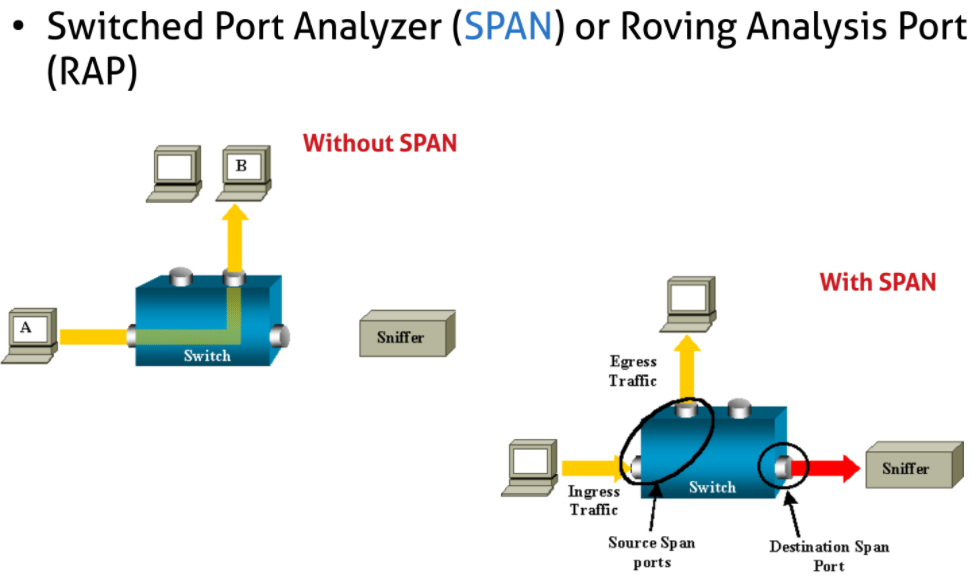
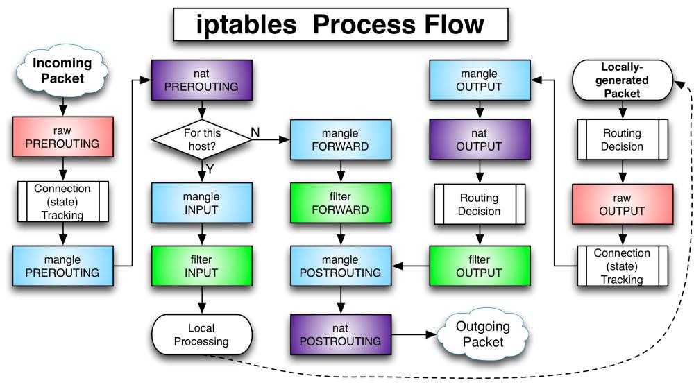
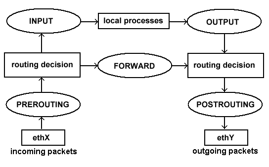

# Network setup

## IProute2

> ([iproute2 Howto Wiki](http://www.policyrouting.org/iproute2.doc.html)) offers complete low-level network configuration 

| command | description | 
| --| --|
|ip link \ ip l  | show physical interfaces  |
|ip link set ethx address a:b:c:d:e:f  | set MAC address |
|ip link set ethx [up\down]  | plug-unplug cable  |  			    
|ip addr \ ip a show [dev ethx]  | show ip address  | 
|ip addr [add\del] a.b.c.d/m dev ethx  | add/remove ip address |			    
|ip addr flush [dev ethx]  | remove any assigned address |
|ip addr replace a.b.c.d/m dev ethx  | instead of flush+add during startup   |
|ip route \ ip r [list\flush]  | list\flush routing table |	 
|ip route [add\del] a.b.c.d/m via [next_hop]  | add/del route by next hop|			    
|ip route [add\del] default via a.b.c.d  | add/del default route|
|watch ip r  | real-time populated routing table     |
|ip route [add\del] a.b.c.d/m dev ethx  | Direct forwarding |
|ip neigh [flush\show] dev ethx  | show/flush ARP table |

> [ifconfig man page](https://man7.org/linux/man-pages/man8/ifconfig.8.html) - [examples](https://www.tecmint.com/ifconfig-command-examples/)

| ifconfig commands  | for legacy systems     |
| -- |-- |
| ifconfig (-a) [ethx]  | display all active interfaces and details |
|ifconfig \ [ifup\ifdown] ethx  [up\down]  | enable\disable ethx   |	
|ifconfig ethx a.b.c.d netmask A.B.C.D broadcast e.f.g.h  | config IP of ethx interface |    
| ifconfig ethx hw ether AA:BB:CC:DD:EE:FF  | change MAC address |
| route add default gw a.b.c.d  | set default route gateway  |

> [route man page](https://man7.org/linux/man-pages/man8/route.8.html)

## kathara files

> - /shared.startup (shell commands for all vm inside kathara lab)
> - /vm.startup (booting command for specific vm)
> - /lab.conf (physical topology and collision domain definition)
> - /vm/etc/network/interfaces (network interfaces file for static IP config)
> - /etc/resolv.conf (contains DNS IP addresses)

## How configure topology of networks

> [Debian Network Setup](https://www.debian.org/doc/manuals/debian-reference/ch05.en.html)

- In order to `properly` use Internet an Host has to receive `4 main pieces` on information:
  - The IP address
  - The netmask (defines Network/host portion of IP address)
  - The IP address of its Default Gateway (device in local network `able to access` the Distribution layer)
  - The IP address of a DNS (a remote server `able to translate` human intelligible names to IP addresses)
  - definition of MTU as shown :
```bash
      sudo ip link set eth0 mtu 1400 
      ifconfig emX mtu 1400
```
> configuration can be `static`: inside */vm/etc/network/interfaces* or at `startup` using *ifconfig* or *iproute2* commands; (ex. on lab1)

## DHCP3 setup

> ([wiki](https://it.wikipedia.org/wiki/Dynamic_Host_Configuration_Protocol)) It's a client-server mechanism implemented by deamon `dhcpd` where the Server has a `pool` of IP addresses to distribute together with the network configuration


>   <p align = "center" > 	<em> DHCP address exchange </em> </p>


>  Clients requesting a new IP address receive a proposal and accept it, once accepted the IP is `reserved` for a "leasing time"

- DHCP procedure uses `udp` protocol on port 67(srv) / 68(client):
  - Host broadcast "DHCP Discover"
  - DHCP Srv. responds with "DHCP offer"
  - Host request IP addr "DHCP request"
  - DHCP Srv. sends addr "DHCP ACKNOWLEDGE"

- udhcp configuration:
  1. install package (*apt install -f udhcpd*) inside startup file 
  2. set up *rx/etc/udhcpd.conf* file as shown here: [udhcp.conf-syntax](https://udhcp.busybox.net/udhcpd.conf)
  3. start daemon (*udhcpd /etc/udhcpd.conf*) inside startup file
  4. set up client:
     -  inside *pcy/etc/network/interfaces* file: *iface ethx inet dhcp*
     -  (*dhclient ethx*) inside startup file

## Host Connection Script

works on: lab2/ex1

> how connect `host machine` to `VM` (guest machine)?

> after starting the lab we need to link one collision domain(local net) to a `virtual interface` ($veth_x\ veth_y$)

> we need to find the `docker image` related to the `collision domain` we want to connect : there exists `one for each network` with the same name as defined in the `.lab file`
```bash
sudo ip link del veth1 type veth
sudo ip link add veth1 type veth
sudo ip addr flush veth0
sudo ip addr add [addr/x] dev veth0

# find docker image of local network
sudo docker network list | grep kathara_[user]-xxxx_[lan]
                         | grep kathara_xxx

#bridge = xxx
brctl show | grep -o 'kt-[a-z0-9]'  # find right virtual-bridge to connect

sudo ip link set veth1 master kt-xxxx                        

sudo ip link set veth0 up
sudo ip link set veth1 up

ip addr show dev veth1
ip addr show dev veth1
```
```bash
# on host machine ---listening on veth1
~$ tcpdump -ni veth1  

# host already has IPv6 scope address (by default...)
~$ ping fe80::101%veth0 # (only local lan)

# ---speaking through veth0
~$ sudo ip addr add [IPv6Addr/64] dev veth0
ping -I veth0 2001:db8:cafe:2::10x  # (all lab is reachable)

it works...
./connect-lab .sh (a .b. c.d /x) ( lan_name ) # connect to broadcast domain with given IP address
```

## Network Traffic Monitoring

> Packets flow in the network, to capture them use a `network traffic dump tool` like:

- dumpcap/wireshark/tcpdump
-  wireshark and tcpdump can `visualize, save and analyze captured packets`
-  [Promiscuous/monitor mode](https://en.wikipedia.org/wiki/Promiscuous_mode): NIC/WNIC pass all the observable traffic without discrimination to the CPU
- Capturing all the packets can be messy:`use filters!` to focus on specific packets, connection or activity patterns
- `Display filters`: inspect only packets you want to analyse and display packets `matching the filters`, packets are `not discarded or lost` (wireshark)
- `Capture filters`: Limit the traffic captured and analysed. packets not captured `are lost!`(tcpdump)

### How capture Network traffic?

- Promiscuous mode (can be limited by switches)
- Physical tap interface (directly to LAN cable)
- Port mirroring on a managed switch:
  - Usually only destination port receive packets:`SPAN` send all traffic to switch `analyser/sniffer`
- Aggressive approaches for sniffing:
  - ARP cache poisoning (spoofing):steal IP addresses using Unsolicited ARP replies ([ettercap](https://www.ettercap-project.org/),cain¿abel)
  - MAC flooding: fill the CAM Table of switch to make it acting as a hub (macof)
  - DHCP redirection: steal(exhausts) IP addresses from the pool, then pretend to be the default GW with new DHCP requests
  - redirection and interception of ICMP packets


> <p align = "center" > 	<em> SPAN-RAP </em> </p>


### How prevent packet capture?

> methods implemented in switches

- `Dynamic address inspection(DAI)`: validates APR packets
- `IP-to-MAC address binding inspection`: drop invalid packets
- `DHCP snooping`: distinguish between trusted and untrusted ports and uses a `database` of IP-to-MAC;
  - ports that show rogue activity can be `automatically disabled`

## Packet inspection with tcpdump

> Dummy example: we connect Host machine using script, then we use `netcat` to create a UDP/TCP connection between 2 host and capture traffic with [tcpdump](https://www.tcpdump.org/manpages/tcpdump.1.html) finally visualize it on host machine with wireshark(file.pcap)

|netcat | . | 
|--|--|
|nc (-u) [ip-addr] [port] | TCP/UDP connection through port |
|nc (-u) -l -p [port] | Listen on port |

> when capturing on vm remember to save file.pcap on */shared* folder 

| tcpdump | (on listener Host) |
|--|--|
| (ctrl+z) + | (bg) |
| tcpdump -ni [ethx/any] -w /shared/file.pcap | (-n) not resolve DNS (-i) define interface (-w) write on |

|ports check |([ss-guide](https://phoenixnap.com/kb/ss-command#)) |
|--|--|
|ss -a| display all listening and non-listening connections|
|ss (-l) (-p/u)|only listening sockets + TCP/UDP connections|
|ss dst (addr) |connections to a specific destination |
|ss (options) dst :(port number or name)|for a specific destination port number or port name|
| (-l) listening sockets (-u -t -x) udp,tcp,unix | . |
| lsof -P -n -i(IPv4) | info about files opened by proceses |
| netstat | connections states with localhost |
| (-ltn) listening,tcp,no resolve | | 

## Network Manager
> [NetworkManager_Guide](https://developer-old.gnome.org/NetworkManager/stable/nmcli.html)

|nmcli ||
|--|--|
|nmcli device show [ethx] | show interface main info|

## shared folder

> how `enable` hostHome folder?  \
> *home/user/.conf/kathara.conf* \
>  "hosthome_mount" : true --> `shared` folder will be availabe for exchange of files...

### ex1 

> GOAL: Manually configure pc1-3 in order to be in the same network than r1 as 192.168.100.30/29

- Configure pc1 using the `interface` file; pc2 using iproute2; pc3 using ifconfig (on startup files)
- add DNS server + default gateway as r1 + verify connectivity within network and internet

### ex2

> GOAL: Configure r1,pc1,pc2 in order to receive their networking configuration from a DHCP server(r1);
DNS is the server used by host machine; gw and DHCP server is r1 using udhcpd (apt install udhcpd)

- configure pc1 using `interface` file and pc2 using `dhclient` command (on shell after startup)

### ex3

> GOAL: assign IP addresses + configure the network in order to be reachable and assign subnetworks
using address:172.16.0.0/16

- The address can be split in 3 subnetworks of `6 hosts and 3bits each:`
	- 172.16.0.0/29 .0->.7 (lan1)
	- 172.16.0.8/29 .8->.15 (lan2)
	- 172.16.0.0/29 .16->.23 (internal)
	
### ex4

> Activity1: Connect to the kathara lab, get http page and capture packets using

1. *./connect-lab.sh 10.0.0.x/24*
2. *tcpdump -ni any -w /shared/capture.pcap* (on pc1)
3. wget http://10.0.0.1/da|ba.php (on host machine)
4. analyse and compare files with wireshark

> Activity2: Connect to open ftp/sftp server and use filters to search for user/password

1. *tcpdump -ni any -w capture.pcap*
2. *ftp test.rebex.net* (demo:password)
3. *sftp demo@test.rebex.net* (demo:password)
4. analyse -> sftp is encrypted!!

* * *

# References

> [HOWTO_IPv6](https://tldp.org/HOWTO/Linux+IPv6-HOWTO/index.html)

# Privileges

1. enable IPv6 on kathara settings
2. start lab VMs with privileges or by bash script:
```bash
#!/bin/bash
xrdb ../.XDefaults
sudo kathara lstart --privileged
for p in pc1 pc2 pc3 pc4
do
  xterm -e bash -c "kathara connect $p" &
done
xrdb ../.XDefaults.alt
xterm -e bash -c "kathara connect r1" &
```

# IPv6 static configuration

> ([interfaces man_Page](https://manpages.debian.org/stretch/ifupdown/interfaces.5.en.html)) we can configure both GUA and Link local addresses just adding `inet6` inside *pcx/etc/network/interfaces*
```bash
## remember tabs!!
auto eth0
iface eth0 inet6 static
  address fe80::101
  netmask 64
  gateway fe80::1
  dad-attempts 0

iface eth0 inet6 static
  address	2001:DB8:CAFE:1::101
  netmask	64
  gateway	2001:DB8:CAFE:1::1
  dad-attempts 0
  dns-domain net.local
  dns-nameservers 2001:4860:4860::8888
```
then we need to manually enable interfaces inside *pcx.startup*
```bash
## only for interface configuration 
ifup -a
ifquery -l
## route add
ip -6 route add default via fe80::1 dev eth0 
#ip -6 route add 2001:db8:cafe:2::/64 via fe80::1 dev eth0
```

# IPv6 IpRoute2 Configuration

| ipRoute2 | --|
| --| --| 
|ip -6 addr add (ll-GUA)/64 dev ethx| add IPv6 Unicast address|
|ip -6 addr add `scope link` fe80::1/64 dev ethx | add Link-local address|
|ip -6 route add default via (`ll`) dev ethx|add default route via link local|
|ip -6 route add 2001:db8:cafe:1::/64 dev ethx|add route|
|ip -6 route show | show IPv6 routing table|
> Default gw `is always a link-local` address. This address is also used for `Router Solicitation-Advertisement`

|ifconfig|--|
|--|--|
|ifconfig ethx inet6 add (ll-GUA)/64| add IPv6 Unicast address |
|route -A inet6 (add\del) default gw (`ll`) dev ethx| add default route via Link Local|
|route -A inet6 add 2001:db8:cafe:1::/64 dev ethx| add Route|
| route -6 | show IPv6 routing table |

|How ping IPv6||
|--|--|
|ping (GUA) | Works!! |
|ping -6 fe80::10x%ethx | ONLY ONE that works for link local destinations|
|ping -6 fe80::10x -I ethx|works for GUA + link local destinations|

# SLAAC Configuration

## Network Flags (sysctl)

> ([sysctl-flags](https://www.kernel.org/doc/Documentation/networking/ip-sysctl.txt)) flags for `low level configuration` inside linux (like windows registers)

> inside **/proc/sys/`net`/ipv6/conf/(all-$eht_x$)**  we have network flags for IPv6 interfaces configuration

they can be set on */lab.conf* file :
```bash
...
pcx[sysctl]= "net.ipv6.conf.all.(flag_name) = (value)"
r1[sysctl]= "net.ipv6.conf.all.accept_ra=0"
...
```
on *startup file* only on `privileged mode` :
```bash
sysctl -w net.ipv6.conf.all.(flag_name) = (boolean/number)
sysctl (dot-notation variable)  ##show flag value
```
|Used Flags| net.ipv6.conf.all.*|
|--|--|
|.forwarding|boolean - behave like a Router - packets received on this interfaces can be forwarded|
|.accept_ra|Accept RA and `enable autoconfiguration` using them|
|..|0-> Do not accept RA (static Addr Routers)|
|..|1-> Accept RA if .forwarding is disabled (for $pc_x$ that uses SLAAC)|
|..|2-> Overrule forwarding behaviour|
|.addr_gen_mode|define `how` link-local and autoconf `addr are generated`|
|..|0-> EUI-64 (default)|
|..|1-> DO NOT generate link-local + EUI-64 for autoconf addr|
|..|2-> generate `stable privacy addresses` using stable secret ([RFC7217](https://datatracker.ietf.org/doc/html/rfc7217)) - balance privacy and stability|
|..|3-> generate `stable privacy addresses` using random secret|
|.stable_secret|IPv6 addr - this address will be used as `secret` to generate IPv6 addr for link local and autoconf ones|
|..|Writes to conf/all/stable_secret are refused ; It is recommended to generate this secret `during startup` and `keep it stable` after that|
|.use_tempaddr|preference for `Privacy Extensions`|
|..|<=0 : disable privacy extensions (default)|
|..|==1 : enable + prefer public over temporary addr|
|..|>1  : enable + prefer temporary over public addr|
|..|==-1: for `point-to-point,loopback` devices|
|.temp_valid_lft|`valid Lifetime` (in seconds) for `temporary addr` (604800 - 7 days)|
|.temp_prefered_lft|`preferred lifetime` (in seconds) for `Temporary addr`|
|.accept_ra_pinfo|boolean - Learn `prefix information` in RA|
|..|enabled if .accept_ra is enabled|
|..|disabled if .accept_ra is disabled|
|.autoconf|boolean - Autoconfigure address using `prefix information` in RA|
|..|enabled if .accept_ra_pinfo is enabled|
|..|disabled if .accept_ra_pinfo is disabled|

## Router Advertisement Daemon

> ([quick-radvd](https://www.linuxtopia.org/online_books/network_administration_guides/Linux+IPv6-HOWTO/hints-daemons-radvd.html)) in order to activate SLAAC autoconfiguration the default IPv6 Gateway Router needs to enable the `daemon` delegated to manage the Autoconfigration via RA-RS messages

- ([radvd.conf](https://manpages.debian.org/testing/radvd/radvd.conf.5.en.html)) */etc/radvd.conf* file : 
```
interface ethx { 
        AdvSendAdvert on;
        MinRtrAdvInterval 3; 
        MaxRtrAdvInterval 10;
        prefix prefix/length { 
                AdvOnLink on; 
                AdvAutonomous on; 
                AdvRouterAddr on; 
        };
        route prefix/length {
	            ## list of route specific options
        };        
};
```
- */rx.startup* file :
```bash 
## static config ...
ifup eth0
ifup eth1
...
## download and START RA-daemon
dpkg -i radvd_1%3a2.15-2_amd64.deb
radvd -m logfile -l /var/log/radvd.log
```

# SLAAC + DHCPv6 Stateless Configuration

## DNSMASQ 
> ([man_Page](https://thekelleys.org.uk/dnsmasq/docs/dnsmasq-man.html#index)) is a `lightweight` DNS, router advertisement and DHCPv4-6 server

when starts, DNSMASQ reads configuration options inside ***/etc/dnsmasq.conf*** file
>  - ([dnsmasq.conf](https://github.com/imp/dnsmasq/blob/master/dnsmasq.conf.example)) :: `for every service of DNSMASQ we have comments and descriptions` 
>   - to enable an option just uncomment specific row

some available options inside `/etc/dnsmasq.conf` :
```bash
# If you don't want dnsmasq to read /etc/resolv.conf or any other
# file, getting its servers from this file instead (see below), then
# uncomment this.
no-resolv

# Add other name servers here, with domain specs if they are for
# non-public domains.
server=/localnet/192.168.0.1

# If you want dnsmasq to listen for DHCP and DNS requests only on
# specified interfaces (and the loopback) give the name of the
# interface (eg eth0) here.
# Repeat the line for more than one interface.
interface=ehtx

# If you want dnsmasq to provide only DNS service on an interface,
# configure it as shown above, and then use the following line to
# disable DHCP and TFTP on it.
no-dhcp-interface=ethy

# Set the domain for dnsmasq. this is optional, but if it is set, it
# does the following things.
# 1) Allows DHCP hosts to have fully qualified domain names, as long
#     as the domain part matches this setting.
# 2) Sets the "domain" DHCP option thereby potentially setting the
#    domain of all systems configured by DHCP
# 3) Provides the domain part for "expand-hosts"
domain=netsec.local

# Send DHCPv6 option. Note [] around IPv6 addresses.
dhcp-option=option6:dns-server,[1234::77],[1234::88]

# Send DHCPv6 option for namservers as the machine running 
# dnsmasq and another.
dhcp-option=option6:dns-server,[::],[1234::88]

# Uncomment this to enable the integrated DHCP server, you need
# to supply the range of addresses available for lease and optionally
# a lease time. If you have more than one network, you will need to
# repeat this for each network on which you want to supply DHCP
# service.
dhcp-range=192.168.0.50,192.168.0.150,12h

# Enable DHCPv6. Note that the prefix-length does not need to be specified
# and defaults to 64 if missing/
dhcp-range=1234::2, 1234::500, 64, 12h

# Do stateless DHCP, SLAAC, and generate DNS names for SLAAC addresses
# from DHCPv4 leases.
dhcp-range=1234::, ra-stateless, ra-names

# Set the DHCP server to authoritative mode. In this mode it will barge in
# and take over the lease for any client which broadcasts on the network,
# whether it has a record of the lease or not. This avoids long timeouts
# when a machine wakes up on a new network. DO NOT enable this if there's
# the slightest chance that you might end up accidentally configuring a DHCP
# server for your campus/company accidentally. The ISC server uses
# the same option, and this URL provides more information:
# http://www.isc.org/files/auth.html
dhcp-authoritative

# Include all files in a directory which end in .conf
conf-dir=/etc/dnsmasq.d/,*.conf
```
usually we `don't modify` this file but instead create a new file : `/etc/dnsmasq.d/,*.conf` were we enable all configuration options we need
- this folder must be enable inside dnsmasq.conf
- always check syntax with `$ dnsmasq --test`
- EXAMPLE of [dnsmasq_Configuration](https://www.tecmint.com/setup-a-dns-dhcp-server-using-dnsmasq-on-centos-rhel/)
```bash
# test configuration file syntax
dnsmasq --test 
# start dnsmasq
dnsmasq -d (debug mode) -k(run as normal) -p(def listening port)
# restart on the run
systemctl restart dnsmasq 
```

## Dibbler Client

> ([man_Page](https://manpages.debian.org/testing/dibbler-client/dibbler-client.8.en.html)) is a portable implementation of the `DHCPv6 client`

we configure client inside ***/etc/dibbler/client.conf*** file
>  - ([DIBBLER-portable guide](https://klub.com.pl/dhcpv6/doc/dibbler-user.pdf)) :: as for dnsmasq also for dibbler configuration files `for every option we have comments and descriptions` 
>   - to enable an option just uncomment specific row

general `/etc/dibbler/client.conf` file :

```bash
# Defaults for dibbler-client.
# installed at /etc/dibbler/client.conf by the maintainer scripts

# 8 (Debug) is most verbose. 7 (Info) is usually the best option
log-level 7

# To perform stateless (i.e. options only) configuration, uncomment
# this line below and remove any "ia" keywords from interface definitions
stateless

iface eth0 {
# ask for address
#      ai
# ask for options
    option dns-server
    option domain
#    option ntp-server
#    option time-zone
#    option sip-server
#    option sip-domain
#    option nis-server
#    option nis-domain
#    option nis+-server
#    option nis+-domain
}
```
```bash
# check status
dibbler-client status
# start/stop daemon
dibbler-client start/stop
```

# prefix delegation + MTU + ex4-5-6


### EX1

> GOAL: to configure the topology to use static IPv6 addresses.You have to provide static GUA addresses to the machines in the topology, `both link-local and GUA`

- Insert IPv6 information inside interfaces file
- use pcx.startup for enable interfaces and create routes
  - remember to `flush` past address inside startup:
~~~~bash
## first thing first
ip addr flush ethx
## legacy only
/etc/init.d/networking restart
...
echo "nameserver 8.8.8.8" > /etc/resolv.conf
...
~~~~
- Use IProute2 commands for configure addresses + routes inside others VMs
  - remember to add `at least one scope link` + GUA

### EX2

> GOAL: to configure the topology to use `SLAAC IPv6 addresses`. The router is already configured to
advertise prefixes in both the lans

You should check the sysctl ipv6 settings

**Sysctl write can only be done in the lab.conf OR in a priviledged container**

1. RA daemon + router flags already set
2. set pcx flags in lab.conf 
   1. pc1+3:default-EUI64 / pc2:random ID / pc4:random ID+ Privacy extensions;
   ```bash
   ## lab.conf
   ...
    r1[sysctl]="net.ipv6.conf.all.forwarding=1"
    # accept RS only
    r1[sysctl]="net.ipv6.conf.all.accept_ra=0" 
   ...
   ## all pcx accepts RA
   pcx[sysctl]="net.ipv6.conf.all.forwarding=0"
   pcx[sysctl]="net.ipv6.conf.all.accept_ra=1"
   ...
   ## addr_gen_mode  
    # default : EUI-64 + LL
    pc1[sysctl]="net.ipv6.conf.all.addr_gen_mode=0"

    # random Int ID
    pc2[sysctl]="net.ipv6.conf.all.addr_gen_mode=3"

    # EUI-64 + NO LL
    pc3[sysctl]="net.ipv6.conf.all.addr_gen_mode=2"

    # random Int ID + use privacy extensions + shorter lifetime
    pc4[sysctl]="net.ipv6.conf.all.addr_gen_mode=3"
    pc4[sysctl]="net.ipv6.conf.all.use_tempaddr=2"
    pc4[sysctl]="net.ipv6.conf.all.temp_valid_lft=120"
   ```
3. start radvd-DAEMON `on RUNTIME and capture` with tcpdump
   ```bash
   tcpdump -ni ethx -w /shared/capture.pcap
   ## start on runtime
   radvd -m logfile -l /var/log/radvd.log
   ```

- route is working and also ping over networks OKOKOK

### EX3

> GOAL: to configure the topology using `SLAAC+DHCPv6` to provide GUA addresses

***It is a stateless dynamic addressing***

1. configure router/gw as SLAAC (static) by interfaces file
   - `::1` on every IPv6 addr
   - define [domain + DNS] inside interfaces file
2. flags as SLAAC 
```bash
#Router is STATICALLY configured inside interfaces file
r1[sysctl]="net.ipv6.conf.eth0.autoconf=0"
...
pcx[sysctl]="net.ipv6.conf.all.accept_ra=1"
pcx[sysctl]="net.ipv6.conf.all.addr_gen_mode=0"
...
```
3. use `DNSMASQ` instead of RADVD 
   - options configured : route + DNS + prefix + IPv4 + stateless
     1. install it 
     2. configure ***/etc/dnsmasq.conf*** file:
        ```bash
        no-resolv
        interface=eth0
        domain=netsec.local
        server=8.8.8.8
        server=2001:4860:4860::8888
        server=/netsec.local/fe80::1
        #no need for netmask
        dhcp-range=192.168.100.2,192.168.100.254,12h
        #default 64
        dhcp-range=2001:DB8:FEDE:1::, ra-stateless, ra-names
        dhcp-authoritative
        ```
        3.test it
        ```bash
        dnsmasq --test
        ```
        4.start it !!

4. `DNSMASQ` Clients
   - pc2 with dhclient (ipv4) 
   - pc1 uses `DIBBLER-CLIENT`:
     - configure it and start daemon!
        ```bash
        log-level 7
        stateless

        iface eth0 {
            option dns-server
            option domain
        }
        ```
        ```bash
        dibbler-client start
        ```
        
* * *

# Iptables Fundamentals
- [Netfilter](https://it.wikipedia.org/wiki/Netfilter) : linux kernel framework that provides hook handling for intercepting & manipulating network packets
- [Hooks](https://en.wikipedia.org/wiki/Hooking) : entities (like modules) that allow packets `manipulation` during their traversing
  -  when intercepted by there hooks the IP packet is verified against a given set of `matching rules` and processed by an `action` configured by the user  
- [Iptables](https://www.frozentux.net/iptables-tutorial/iptables-tutorial.html): Userspace level configurator 
  - *order of matching rules is important*
  - packets fates depend on the *first matching rule*
  - If no match the *default policy will be applied*
  - every chain has its *default policy* 
- [Iptables_book](https://book.huihoo.com/iptables-tutorial/book1.htm)
- [ip6tables_man](https://linux.die.net/man/8/ip6tables)

 
> ***TABLES** (operation over a packet) as set of **CHAINS** (how packets are elaborated)(queues) as set of **RULES**(match+action);*

## built-in tables 

each table defines a different kind of operation that can be perform over the packets 

- **filter** => filtering of packets : allow or block packets (accept/drop), every packet pass through this table
  - (INPUT / OUTPUT / FORWARD)
- **nat** => address-port translation (SNAT/DNAT/MASQUERADE) : the first packet of a connection pass through this table then its result define behavior of next packets belonging to the same connection
  - (PRE_ROUTING / POST_ROUTING / OUTPUT)
- **mangle** => packet header modification (QoS), every packet pass through this table and contain all predefined chains
  - (PRE_ROUTING / POST_ROUTING / INPUT / OUTPUT / FORWARD )
- **raw** => avoid connection tracking
  - (PRE_ROUTING / OUTPUT)

## built-in chains

>   

Every packet pass through a set of hook-chains of multiple tables, each rule inside tables check a match. If match, other rules will be ignored


>   

## Iptables Flow

- local generated packets : 
  - Local Process -> OUTPUT -> POST_ROUTING -> NET
- Forwarded Packets :
  -  NET -> PRE_ROUTING -> FORWARD -> POST_ROUTING -> NET 
- Locally Addressed packets :
  -  NET -> PRE_ROUTING -> INPUT -> Local Process

## build-in rules

> <center>[Match + target]</center>
- **Match** : specification of the packet processed, a `special condition` within the packet that must be true (or false)
  - [GENERIC_mtc](https://www.frozentux.net/iptables-tutorial/iptables-tutorial.html#GENERICMATCHES) : always available, *whatever* the protocol or extension we are working on
  - [IMPLICIT_mtc](https://www.frozentux.net/iptables-tutorial/iptables-tutorial.html#IMPLICITMATCHES) : three types of implicit matches for three different protocols(TCP\UDP\ICMP). These are **unique criteria** available only for those protocol packets 
    - ... -p --protocol *tcp | udp | icmp* [imp_mtc] ...
  - [EXPLICIT_mtc](https://www.frozentux.net/iptables-tutorial/iptables-tutorial.html#EXPLICITMATCHES) : have to be specifically loaded with the **-m or --match** option as extension module 
    - ... -m *addrtype | state | multiport | conntrack* [exp_mtc]... 
- **Target** : how manipulate the packet matching the rule, what Action to perform 

|**Target**|*how manipulate the packet matching the rule : what Action to perform*|
|--|--|
|ACCEPT| result depends on the current chain in the current table|
  | DROP | delete without sent back NACK |
  | QUEUE |  send packets to upper layers programs and applications|
  | RETURN | packet go to default policy of current chain, if sub-chain then travel through superior chain
  | REJECT | equal to DROP + send back ICMP error (**only** for filter table and its chains) 
  | LOG | logging packets, debugging of rules if used instead of DROP ([syslogd](https://linux.die.net/man/8/syslogd))
  | DNAT | override IP destination address of packet and *all subsequent packets in the same stream* (**only** for NAT table and PRE_ROUTING + OUTPUT chains) 
  | SNAT | (--to-source) override IP source address of packet, used when multiple hosts share same Public IP Address (**only** for NAT table and POST_ROUTING chain)
  | MASQUERADE | as SNAT but for dynamically assigned IP connections, *we set the IP address used on a specific network interface instead of the (--to-source) option* (**only** for NAT table and POST_ROUTING chain)
  | ... | [other_TARGETS](https://www.frozentux.net/iptables-tutorial/iptables-tutorial.html#TARGETS)

# Stateful packet filtering 

## Connection Tracking machine 
> [The state machine](https://www.frozentux.net/iptables-tutorial/iptables-tutorial.html#STATEMACHINE) is the name of the *connection tracking machine* inside Netfilter framework. Used **to know the state of a specific connection**

- Firewalls implementing this are **stateful** :
  - packets can be related (group by) to their connection so it's possible to define rules based on the common relation of packets
  - NAT table use this info to apply action at packets of the same connection
- packets are related to tracked connections in [*user-land states*](https://book.huihoo.com/iptables-tutorial/x4342.htm) with *state match extension* :
  - Flows : [TCP](https://book.huihoo.com/iptables-tutorial/x4436.htm) - [UDP](https://book.huihoo.com/iptables-tutorial/x4596.htm) - [ICMP](https://book.huihoo.com/iptables-tutorial/x4634.htm)
  - **-m state --state [s]** 

|"s"|packet is ...|
|--|--|
|NEW |start of a new\un-established connection|
|ESTABLISHED |part of a connection already registered in the kernel or established |
|RELATED|start of new connection created by an older established one |
| INVALID| can't be identified or that it does not have any state(ALWAYS DROP) |
| UNTRACKED | marked within the RAW table with the NOTRACK target | 
  
- [Conntrack match](https://book.huihoo.com/iptables-tutorial/x6330.htm#CONNTRACKMATCH) is an extended version of the state match 
  - **-m conntrack [option]**
- [*/proc/net/ip_conntrack*](https://book.huihoo.com/iptables-tutorial/x4273.htm) : list of current entries in conntrack database, all info maintained by the module **to know in which state a specific connection is**

# Commands & Syntax
> *$ iptables <span style="color:red"> [command] [chain] </span> [table] <span style="color:blue">[match]</span>
<span style="color:green">[target/jump]</span>*
> - $ iptables <span style="color:red"> -A POSTROUTING </span> -t nat <span style="color:blue">-o eth0 </span> <span style="color:green">-j MASQUERADE </span>

- tables -> chains -> rules -> target -> action || jump to  different chain
- default table --> filter table  
- tables as small letters // chains as CAPITAL LETTERS
- commands as CAPITAL LETTERS // option as small letters

|-L --list options | --  | 
|--|--|
|-v | verbose|
|-n | numerical values, no name resolv |
|--line-numbers | show rule number|
|-L -v -f filter | show **number** of packets **matched** by the rule |
|**[Cmds+Options_tutorial](https://book.huihoo.com/iptables-tutorial/x5245.htm)**|**[Jump to other Chains_example](https://www.frozentux.net/iptables-tutorial/chunkyhtml/c3965.html)**|

```bash
rule -> [match] + -j [target]

# append / delete / insert / replace rules
iptables [-t table] {-A | -D} chain rule
iptables [-t table] -D chain rule_number
iptables [-t table] -I chain [rule_number] rule
iptables [-t table] -R chain rule_number rule

# list / flush rules
iptables -L -n -v --line-numbers
iptables [-t table] {-L|-F} chain

# set policy / new / delete(empty-ONLY) / rename chain
iptables [-t table] -P chain new_policy_target
iptables [-t table] {-N|-X} chain
iptables [-t table] -E old_chain new_chain_name
```
## common switches

|Useful iptables|command switches|
|--|--|
-t table |Specifies the table (filter if not given)
-j target |Jump to the target (it can be another chain)
-A chain |Append a rule to the specified chain
-p --protocol [prt] | Match the protocol type
-s --src [ip-address] |Match the source IP address
-d --dst [ip-address] |Match the destination IP address
-i --in-interface [eth-name] |Match input interface (from which the packet enters)
-o --out-interface [eth-name] |Match output interface (on which the packet exits)
! (==not) |Used to negate the match. Can be used with many flags, Example: all the source addresses but a specific one **-s ! ip_address**
-f |Match fragments which are not the first of a packet

|--|--|
|--|--|
-p tcp --sport port |Match the tcp source port
-p tcp --dport port |Match the tcp destination port
-p udp --sport port |Match the udp source port
-p udp --dport port |Match the udp destination port
-p icmp --icmp-type type |Match specific ICMP [packet types](https://book.huihoo.com/iptables-tutorial/a12854.htm)
|-p icmpv6 --icmpv6-type type|ip6tables-[icmpv6](https://it.wikipedia.org/wiki/ICMPv6) version|
-m module |Uses an extension module
-m state --state s |Enable **connection tracking**, Match a packet which is in a specific state
-p [ptc] -m multiport --xport port | Enable specification of several ports with one single rule
|-m addrtype --src/dst-type (typ)|Match IP address : UNICAST,MULTICAST,BROADCAST|

|--|--|
|--|--|
--syn |Match packets which start a TCP connection, It is equivalent to --tcp-flags SYN,RST,ACK SYN
-n |Used to avoid name substitution for IP hosts and port
-m conntrack -ctstate... | Enable connection tracking (superset of state)
-m mac --mac-source |Match packets with a specific source MAC address
-m limit |Limit the number of packets for a specific time period (--limit and --limit-burst) **iptables -A FORWARD -p tcp --syn -m limit --limit 1/s -j ACCEPT**

## create,save rule_set
- `iptables_rules.sh`
```bash 
#!/bin/bash
# flush (clean) the filter table
iptables -t filter -F
# allow only service XX
iptables ...
------------------------
# built-in commands (legacy)
iptables-legacy-save > iptables_rules.sh
iptables-legacy-restore < iptables_rules.sh
```

# Lab Activity
- add **alias** makes rules easier 
```bash
  echo 192.168.10.2 local_host >> /etc/hosts
  echo 2001:db8:cafe:2::2 local6_host >> /etc/hosts
```
- after starting the lab on host machine 
```bash
# add route to VM enviroment
  sudo ip route add 192.168.100.0/24 via 192.168.10.1 dev veth0
# Ipv6 case
  sudo ip -6 route add 2001:db8:cafe:1::/64 via 2001:db8:cafe:2::1 dev veth0
```
- on VM in order to reach outside network they need default route
```bash
  ip -6 route add default via fe80::1 dev eth0
```
- remember to save your configuration **on shared** folder 
```bash
  iptables-save > /shared/r1_RULES.sh
  ip6tables-save > /shared/r1_RULES.sh
```
- visualize **# of packets** matched by your rules
```bash
  iptables -L -v -f filter
  ip6tables -nvL
```
- how get **HTTP pages** in IPv6
```bash
$ wget IPv6_alias
$ wget http://[IPv6_address]:port
```

### EX1,2

> GOAL : Allow HTTP traffic to s1 only 

> GOAL : do the same with IPv6 and `ip6tables`

- create sub-chain for destination traffic towards s1 ONLY
- `iptables backup file` :
```bash
-N S1
-A FORWARD -d 192.168.100.80/32 -j S1
-A S1 -p tcp -m multiport --dports 80,8080 -j ACCEPT
##-A S1 -p tcp -m tcp --dport 22 -j ACCEPT
-A S1 -j REJECT --reject-with icmp-port-unreachable
```

### EX3

> GOAL : implement security policy below
- Use both IPv4 and IPv6
- test your policy from the isp machine (or local-host)
1. Internal Network (eth2)
    - Your internal pcs may freely access any Web service, anywhere, on ports **80 and 443**, but only **if they initiate the connection themselves** (i.e. they are allowed to browse the Web)
    - **No one outside** the internal lan **can initiate** connections to internal lan, on any port
    - Internal users **can access** the Web servers and mail servers **in DMZ via SSH**, too
    - They can also **use SSH** to reach **any host** on the Internet.
    - However, hosts **in DMZ** can only be contacted **on port 22 by** hosts in the **internal lan**
2. DMZ Network (eth1)
   - **Everyone**, including the Internet, can access Web (both ports) and mail in DMZ to access their main functions **and for ping**
   - However, **no host** in DMZ **can initiate connections** anywhere else
- order of rules is important
```bash
# internal to ... 80,334
-A FORWARD -s internalV6/64 (-i eth2) -p tcp -m multiport --dports 80,443 -j ACCEPT

# --> flip : cannot accept NEW packets directed to internal Lan
-A FORWARD -d internalV6/64 (-o eth2) -p tcp -m state ! --state NEW -j ACCEPT
###-A FORWARD -d internalV6/64 (-o eth2) -p icmpv6 ! --icmpv6-type 128 -j ACCEPT

# ping, all packets except for 128 from DMZ (-p icmp)
-A FORWARD -d DMZ/64 (-o eth1) -p icmpv6  -j ACCEPT # verso DMZ ALL ICMP PACKETS
-A FORWARD  (-i eth1) -p icmpv6 ! --icmpv6-type (echo-request --> 128) -j ACCEPT

# DMZ : no new connections
-A FORWARD -s DMZ/64 (-i eth1) -p tcp -m state ! --state NEW -j ACCEPT

# DMZ services 
-A FORWARD -d DMZ/64 (-o eth1) -p tcp -m multiport --dports 80,443,25 -j ACCEPT

# ssh bridge internal-DMZ
-A FORWARD -s internalV6/64 (-i eth2) -d DMZ/64 (-o eth1) -p tcp --dport 22 -j ACCEPT

-P FORWARD DROP
```

* * *