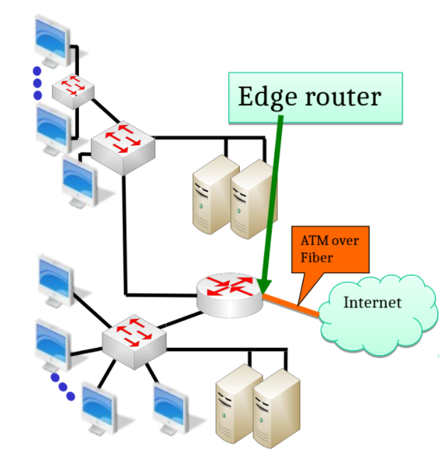

# Networking 101

## What is the Internet?

- An interconnected network of networks
  - `Hierarchical` networks
    * Internet backbone: connecting the ISPs' backbones
    * ISP backbone: connecting organizations' backbones
    * Organization backbone connects local area networks(LANs)
    * LAN connects end systems
  - Public vs private Internet
- Internet Standards
  - RFC: Request for comments
  - IETF: Internet Engineering Task Force
  
## Internet hierarchy

- Network edge
  - Hosts: server,client,P2P
  - Applications: http,mail,Facebook,Twitter
- Network Core
  - Edge router:connecting an organization/ISP to the internet
  - Interconnection of routers using fiber
  - Naming services
- Access networks
  - Wired,wireless communication links

>   

## Internet core Management

- Routers and fiber-links form the internet; Routers works together to figure out the `most efficient path` for routing a packet and *Distributed Alg.* can adapt to changing internet conditions
- The core is provided by *`ISPs`* that *`interconnect`* multiple continents
  - Global IPSs or Tier-1 ISPs
  - Regional ISPs or Tier-2 ISPs
- internet Backbone connects tier-1 ISPs
  - e.g., Verizon,Sprint,AT&T,QWest...
- The Backbones of Tier-1 ISPs are interconnected at various access points called
`Internet eXchange Points`(IXP)

## Protocols

- Specify rules about the desired service
  - Procedure Rules
    * Types and sequences of messages exchanged `syntax and semantics`
    * Actions to take with respect to messages and events
  - Message Format: format,size,coding of messages
  - Timing: the time to wait between any event
- Modularization → Many protocols for each layer
  - Hides implementation details
  - Highly choesive + Low Coupling → Layers can change without disturbing other layers
- Packet Switching-Time Division multiple access(TDMA)
  - best effort delivery
  - Better for resource sharing
- Network congestion and flow control

## Access Layer

>   

- Organization/home LANs or subnet connects hosts to edge router
- Internet uses a `gateway-edge router` to connect a LANs or subnet to the hierarchical network
- ATM: asynchronous transfer mode
- Residential Internet Access:
    - Point to Point protocol(PPP) for access to an ISP
    - DSL: digital subscriber line
    - Cable modem
    - Fiber to the Loop
    - Satellite
    - Broadband over power line or wireless(WiMAX)
- nodes of the same network can directly communicate among them(Ethernet family protocols)

## Ethernet (IEEE 802.3) networks

- each host in Ethernet networks has a `NIC-network internet card` with a "generally" fixed address
- MAC addresses are *48 bits(6 bytes)* long and UNIQUELY identify hosts in the network
- each host only processes packets,with fixed format, intended for it
- `How build one?` All hosts connected together with a `shared transmission system` based on Ethernet are a network as if they were connected to the same medium
  - two-Many computer connected with Eth. cables to a single device (generally `Switch,repeater,hub,bridges...`)

### Ethernet Broadcast Domain

- An Ethernet network constitutes a `Broadcast Domain`
  * also exists collision domains but full-duplex and switches have made them obsolete
- Ideally frames sent in a broadcast domain are potentially `received by all the hosts` in the network (receive all + only read some)

### Switches

- switches *segment* the ethernet network " or collision domain" to limit the explosion of packets
in the network (only broadcast mss are "replicated")
  * Switches `will forward broadcast traffic` on all their interfaces, except the one they received the broadcast on
- switches remember the source MAC addresses on differerent ports
  * `Tables of MAC`: ARP tables for hosts || CAM table for Switches
- they only replicate the frame where the destination MAC address replies

### Why internet is not a large Ethernet net?

- Ethernet makes high use of Broadcast packets → `inefficient` for large networks
- large Networks usually are split in order to reduce the broadcast domain
- There is the need of a LOGICAL division of networks
  * Ethernet is Access layer but we need a Distribution layer
- Hosts in a local net use a `default gateway` to go out and have access to the Distribution Layer
- Ethernet is part of `Data link or Network Access layer`
- Distribution layer is based on `IP, the internet Protocol`

## Distribution and core Layers

- interconnect local networks among them
- Distribution layer is at level of `Autonomous Systems` like big enterprises and ISPs
- Core layer is at the level of `continents`
- they are connected by `Routers` and uses `logical Addressing`: IP
- Routers are the `default gateways` and gives access to the internet

## Ethernet vs IP Addresses

- Ethernet has physical addresses
  - you can not(***) change the MAC address of your NICs
  - Eth address tells `WHO` you are, but does not tell anything on WHERE you are

*** inside we use original MAC; outside the Eth. net we create new MAC address(of the GW) therefore we `destroy and recreate the frame` every time we enter a new Eth. network.

*** usually mac change for every hop. and IP address destination usually does not change;
ip addr change when using NAT

- IP has `LOGICAL` addresses
  - you can change IP address of your NIC
  - tells `WHERE` you are and it changes if you go somewhere
  - IP addresses are used to `identify and reach` networks and hosts
  - local-remote addresses
    * Directly connected → local Address (if both of you are in the same room)
    * else→Remote Address (you need to know before sending the mss)
  - how to know if one IP is in the same network as you? → `Subnet Mask`
  - [Subnet Mask](https://it.wikipedia.org/wiki/Maschera_di_sottorete) defines boundaries between network portion and host portion of the IP address

## IP Addresses

> IPv4 address with 32 bits in four octets(8 bits each) 

> IPv6 address with 128 bits ([IPv6 wiki](https://it.wikipedia.org/wiki/IPv6))

- There are three types of IP addresses
    - Unicast(one to one): refer to a `single destination` host
    - Broadcast(one to all): refer `to every host` on the network or subnet
    - Multicast(one to many): refer to `a group of` IP addresses ion a network, not all of them
- IP Addressing, [Classful](https://it.wikipedia.org/wiki/Classi_di_indirizzi_IP): how we `divide net/host` portion of IP address in a `static way`
    - Class A(24 bits for Host addresses, /8)
    - Class B(16 bits for //, /16) Class C(8 bits for //, /24)
    - Class D([Multicast](https://en.wikipedia.org/wiki/Multicast_address)): no subnet mask is used here; all 32 bits dened a network Group
    - Class E(Reserved)

>   


- `Routable` addresses need to be unique on the internet
- `Non-Routable` addresses are defined in [RFC1918](https://it.wikipedia.org/wiki/Indirizzo_IP_privato)(private addresses)
- 192.168.8.0/24 Class C IP address
    - First address is reserved for `network address`
    - Last address is reserved for `broadcast address`
    $$ 2^{32 - netmask} - 2 $$
> #hosts in any [CIDR](https://it.wikipedia.org/wiki/Supernetting) specified network

## Variable Length Subnet Mask(VLSM)

- Introduced by CIDR(Classless Inter-Domain Routing) as new notation for the netmask as a `flexible way` to allocate the `right number` of hosts in each context
- specify how many bits of the 32-bit total will specify the network address `/x`
- The remaining bits specify the host addresses
- 192.168.1.248/30
  $$ 2^{32−30} − 2 = 2\ hosts$$
  $$ 192.168.1.248\ is\ Network\ Address$$
  $$ 192.168.1.251\ is\ Broadcast\ Address$$
- [RFC 3021](https://datatracker.ietf.org/doc/html/rfc3021): Using `31-Bit prefixes` on IPv4 Point-to-Point Links

## VLSM Addresses examples 

Determine the network part,host part, the network size(numb
of hosts), the network address,the broadcast address,and the type of IP addresses
[(bin converter)](https://www.rapidtables.com/convert/number/binary-to-decimal.html)

- 192.168.4.32 netmask 255.255.255.224
    - $224 → (11100000)_2$ it follows that subnet is `/27`
    - host portion is 5bits and number of hosts in the network are $2^{32−27} − 2 = 30$
    - network address: $192.168.4.(001|00000)_2 = 192.168.4.32/27$
    - broadcast address: $192.168.4.(001|11111)_2 = 192.168.4.63$
    - type of IP address is VLSM derived from a Class C Address
- 10.11.12.0/21
    - host portion of 11bits hosts in the network $2^{32−21} − 2 = 2046$
    - network address: $10.11.(00001|000)_2.0 = 10.11.8.0$
    - broadcast address: $10.11.(00001|111.11111111)_2 = 10.11.15.255$

## Remote Addresses examples

> the destination address is remote or local? if it belongs to
the same network than the host **find /x and check if destination is inside the range of the host network**

>   

>   


## Layering Concepts 

Communication between hosts is organized in tasks, assigned to a `Layer`
- Offer a `service` to the User in the layer `above` + exploit the services offered the layer above
- Tasks involves the exchange of messages that follow a set of rules desined by a `protocol`
- Each layer adds some `protocol information` and provides data to the layer below
- Encapsulation/Decapsulation:
  1. Each layer `adds` some protocol information and provides the data to the `layer below`
  2. the Physical layer sends data over the `physical medium` to the destination
  3. Each protocol in the destination `reads` the appropriate `protocol information` and forwards
  the data to the `layer above`

## Layer ideal representation


> <p align ="center">
*layer concept*
<p/>

- `Transport`: the illusion of direct end-to-end connection between processes
- `Network`: transferring data between arbitrary nodes
- `Data Link`: transferring data between directly connected systems (cable,shared medium)

## Layered architectures 

> All architectures refers to the same type of computer communications network: [Packet switched network](https://en.wikipedia.org/wiki/Packet_switching) 
> where every packet is supposed to travel independently from
others

>   <p align ="center">
*Protocol stack*
<p/>

- Each layer has a `type of address`:
  - Application ly: `internet name` (www.sapienza.it)
  - Transport ly: `Port number` in the range [0..65535] that identifies the client or server application-service
  - Internet ly: `IP address` that identifies a host in a network (where it is) a.b.c.d/h
  - Datalink ly: `MAC address` that identifies a network card (who it is) AA:BB:CC:DD:EE:FF
  
## Transport layer: TCP and UDP

- UDP: no control on data exchange (`connection-less`)
- TCP: Reliable data exchange + Control Flow + [Bigger header](https://www.lifewire.com/tcp-headers-and-udp-headers-explained-817970) + TCP handshake


> [TCP/IP and Data Communications Administration Guide](https://docs.oracle.com/cd/E19504-01/802-5753/index.html) <p align ="center"> *TCP handshake* 
<p/>

## Well-Known Ports 

Range is `[0..65535]`; Source port is **randomly chosen** by OS but `destination port` determines the `required service(application)`

- Assigned Ports `[0..1023]` are said "well-known ports" and used for `standard internet applications`:
  - [TCP/UDP Ports Wiki](https://en.wikipedia.org/wiki/List_of_TCP_and_UDP_port_numbers)
  - [common Well-known ports](https://www.utilizewindows.com/list-of-common-network-port-numbers/)
- Ports `[1024..49151]` can be registered with internet Application Naming Authority IANA
- Ports `[49152..65535]` ephemeral ports


|TCP|  |  |  | | UDP| | ||
|--|--|--|--|--|--|--|--|--|
| FTP| 20-21| SSH |22|...|DNS |53| DHCP |67-68|
| Telnet| 23| SMTP| 25|...| TFTP| 69| SNMP| 161|
|HTTP| 80| IMAP| 143|...| RIP| 520| .| .|
|SSL| 443|.|.|...|. |.|.|.|


* * *


# IPv6 Addressing

## Benefits of IPv6  

- not a new protocol (late 1990s)
- Solve IPv4 shortage of Addresses: **128-bit address space**, written in hexadecimal
- Stateless Configuration and DHCPv6 Stateful
- End-to-End reachability **without private addresses** and **NAT** (not a security feature)
- Better support for mobility: [RFC6275](https://datatracker.ietf.org/doc/html/rfc6275)
- Peer-to-Peer networking easier to create and maintain + more robust QOS and VOIP

--> IPv6 **Source** is always `Unicast` || IPv6 **Destination** can be `Unicast, Multicast or Anycast`

## Hex and IPv6 Address Representation

>([addr types](https://oracle-patches.com/en/cloud-net/ipv6-address-types-unicast,-multicast,-and-anycast)) IPv6 addresses are **128-bit** divided in **(8 x 16-bit)** segments or **hextets** in range [0000:FFFF]
> and Represented as **Hexadecimal digits**: `1 hex digit = 4 Binary bits` separated by ":" ([converter](https://www.rapidtables.com/convert/number/decimal-to-hex.html))


>   
	<p align = "center" >
	<em> IPv6 Address types </em>
</p>


### Compressing IPv6 Addresses Rules

1. `Leading` zeros in any segment do not have to be written , `tailing` zeros must be included
2. Any single, **contiguous segment** of all zeros can be represented with double column `::`
			
## IPv6 Global Unicast Addresses (GUA)

>GUA is identified as `2000::/3` up to `3FFF::/3`
``` 
first 3 binary bits of first hextet 
2000:: --> 0010 0000 0000 0000 ::
-...	   ---. .... .... .... 
```
- Globally `Unique and routable` as IPv4 public addresses; GUA is 1/8th of all addressable space
- **2001:DB8::/32** are reserved for documentation
- All end users will have a global Unicast address					

>  <p align = "center" >
	<em> IPv6 Address Notation </em>
</p>

- Given a *Global Routing Prefix* we can `subnet with 1 hextet` creating up to 65k subnets:
  - `Prefix:` equivalent to *Network address* of IPv4
  - `Prefix length:` equivalent to *subnet mask* of IPv4
  - `Interface ID:` equivalent to *host portion* of an IPv4 address
  - we use `3-1-4 rule` for divide a GUA into `IPv6 /64 local networks` as shown:

>  <p align = "center" >	
	<em> 3-1-4 rule </em>
</p>

## IPv6 Link-Local Unicast Addresses

> link-local is identified as `FE80::/10` up to `FEBF::/10` 
```
first 10 binary bits of first 3 hextets
FE80:: --> 1111 1110 1000 0000:: ==> FEBF:: --> 1111 1110 1011 1111::
---.	   ---- ---- --.. ....                  ---- ---- --.. ....
```

- Used to communicate with other devices `on the link` then `Not Routable`
- `Only have to be unique on the link` (Network segment-internal lan)
- `every IPv6 device` must have `at least` a Link-local address

They are usually created `Automatically` and statically for Routers:
- there are two ways for construct the `Interface ID`:
	- `Random 64 bits` for many hosts
	- Extended unique Identifier 64 [(EUI-64)](https://community.cisco.com/t5/networking-documents/understanding-ipv6-eui-64-bit-address/ta-p/3116953)

>   <p align = "center" >	
	<em> Link-Local Unicast Address </em>
</p>

### EUI-64

Starting from a 48-bit MAC address
  1. the MAC address is separated into `two 24-bits` called OUI(Organizationally Unique Identifier) and the Device Identifier
  2. The 16-bit hextet `0xFFFE` is then inserted between the two 24-bits parts
  3. then the `seventh bit` from the left or the `Universal/local(U/L) bit` is flipped

### Why we use Link-local Addresses?


> Link-Local addresses have an `Important role` in IPv6

→ Used as `Source IPv6 Address` before a device gets one dynamically (SLAAC || DHCPv6)

→ Router's link-local address is used by devices as `default gateway`

→ used by Routers for exchange `routing messages`

→ used by Routers as the `next-hop address` in the routing table


## IPv6 Multicast Addresses

> How send single packet `to multiple destinations` simultaneously? (one-to-many)
>  <p align = "center" >	
	<em> Multicast Address </em>
</p>

* exists two types of Multicast addresses:
> 1. Assigned as `FF00::/8` up to `FFFF::/8` 
```
first 8 binary bits of first 2 hextets 
FF00:: --> 1111 1111 0000 0000:: ==> FFFF:: → 1111 1111 1111 1111::
--..       ---- ---- .... ....       --..     ---- ---- .... ....
```
> 2. Solicited-Node as `FF02::1:FF00:0000/104` 
```bash
fe80::2aa:ff:fe28:9c5a/104                  IPv6 unicast/anycast address (compressed notation)
               -- ----                      the least-significant 24-bits
ff02::1:ff00:0/104                          Solicited-Node multicast address prefix
----  - --                                  The first 104 bits
ff02::1:ff28:9c5a                           Solicited-Node multicast address (compressed notation)
          ** ****
```
  - *generated from `least-significant 24-bits` of Uni/Anycast address*
  - used in the Neighbor Discovery Protocol(NDP) for `Duplicate Address Detection(DAD)`
  - <em>" The Solicited-Node multicast addresses are generated from the host's IPv6 unicast or anycast address, and `each interface must have` a Solicited-Node multicast address associated with it "</em>
    -  [Wiki to Solicited-node Address Example](https://en.wikipedia.org/wiki/Solicited-node_multicast_address)

### scope

4bit field that define the `range` of the Multicast packet:
  - inside Broadcast domain(2)
  - all $eth_x$ of one router(5) *(need to be Enabled)*

|Range|scope value|||
|-|-|-|-|
|Reserved|0|Interface-Local|1|
|Link-Local|2|Site-Local|5|
|Organization-Local|8|Global|E|

### Flag

- 0 :: `Permanent` for [well-known Multicast addresses](https://www.ciscopress.com/articles/article.asp?p=2803866&seqNum=5) assigned by IANA
- 1 :: `Non-permanently-assigned` , "dynamically" assigned

> Well-known Assigned IPv6 Multicast Addresses [IANA-Reference](https://www.iana.org/assignments/ipv6-multicast-addresses/ipv6-multicast-addresses.xhtml)
>  <p align = "center" >	
	<em> Link-local scope Assigned MultiCast Addresses </em>
</p>

>  <p align = "center" >	
	<em> Site-local scope Assigned MultiCast Addresses </em>
</p>

- <u>All IPv6 Devices:</u> `FF02::1` All devices including the router
- every IPv6 device will listen and process packets
- more efficient that IPv4 Ethernet Broadcast

>  <p align = "center" >	
	<em> Router Advertisement </em>
</p>

- <u>All IPv6 Routers:</u> `FF02::2` All Routers
- used by devices to communicate with IPv6 Routers

>  <p align = "center" >	
	<em> Router Solicitation </em>
</p>


* * *


# ICMPv6

> - `error reporting` and `diagnostic functions`
> - messages may be calssified as `error ms`(0-127) or `information ms`(128-255)
> - type of ICMPv6 packet is defined in the `type` field 
> - `code` field provides additional information
> - `format` may change based on type of packet

(NDP) `uses five ICMPv6 packets `to performs its functions`(133-137)`

> -	[(ICMPv6) Parameters](https://www.iana.org/assignments/icmpv6-parameters/icmpv6-parameters.xhtml)
> - [RFC 4443](https://datatracker.ietf.org/doc/html/rfc4443)
> - [wiki](https://en.wikipedia.org/wiki/Internet_Control_Message_Protocol_for_IPv6)

# IPv6 Dynamic Address Configuration

## Neighbour Discovery Protocol(NDP)

>([Wiki](https://en.wikipedia.org/wiki/Neighbor_Discovery_Protocol)) Its a *Link Layer Protocol* and it defines five pakets types(13x) used for:

### IPv6 Address Resolution (IPv4 ARP):

given IPv6 address an host want to know the related `mac of its neighbours` and insert it in the Neighbour Cache using:
- (`135`)Neighbour Solicitation Message: Host asking for `Link-Layer Address(MAC)` of another Host; 
	- `Multicast Request` to find out address of new hosts ([to solicited node](https://en.wikipedia.org/wiki/Solicited-node_multicast_address)):
		- host subscribe to *multicast Group* that correspond to its MAC
		- every time someone wants to reach him they just send a Neighbour Sollicitation to its Multicast Group 
	- `Unicast Request` just to verify if host is reachable or not
- (`136`)Neighbour Advertisement Message: answer to Neighbour Sollicitation message

> When a host connects to a new network, It sends a `Neighbour Solicitation` with multicast destination

Respectively in IPv4 we have:
- ARP Request/Reply messages
- IPv4 uses `Ethernet Broadcast Message` instead of `IPv6 Multicast`
- more efficient => *no broadcast over ethernet* + Reduce packets

### Dynamic IPv6 Address Allocation:

In order to obtain `IPv6 Address information` an host need to send a Solicitation to the Router and then It will answer will an `available configuration` for that specific network `SLAAC, stateless or stateful`


- (`133`)Router Solicitation Message: Host wants to locate `Routers on attached link` and ask for IPv6 configuration Options available
- (`134`)Router Advertisement Message: Routers `advertise their presence` periodically or as respond to a Router Solicitation message
 
> ***ONLY local Router decides type of configuration used in the network***
 


- (`137`)Redirect message: routers inform hosts of a better first hop router for a destination

for IPv4 hosts:
- DHCPv4 or static allocation 

## Stateless Address Autoconfiguration (SLAAC)


Available configuration for host sent by Router Advertisement message can be:
- OPT1: SLAAC - No DHCPv6(default on Cisco Routers): router gives everything (prefix,Def gateway,DNS...) to the host for create its own address
- OPT2: SLAAC + Stateless DHCPv6 for DNS address: router gives info but DNS addresses can be found only `from DHCPv6`
	- OPT 1-2 are `stateless` configuration, then DHCPv6 does `not maintain state` of addresses
	- No full knowledge of the network state or list of addresses used
- OPT3: All hosts except default Gateway use DHCPv6
	- `stateful`: just ask to an DHCPv6 server all info for IPv6 configuration


### SLAAC - No DHCPv6:

Host want to know IPv6 information for Autoconfiguration OPT1 so it sends a Router Solicitation and local Router answer with
`Option 1 - RA Message`:
```
to: 		FF02::1 all-IPv6 devices (multicast addr)
From:		FE80::1 default Gateway  (Link-Local addr)
Prefix:		2001:DB8:CAFE:1::	 (of this network)
Prefix-length:	/64
+ DNS info
```
Local Host now knows:
```
Network Prefix:	2001:DB8:CAFE:1::
Prefix-len:		/64
ll Def Gateway:	FE80::1
---------------------------------
Global Unicast Address:
2001:DB8:CAFE:1: + Interface ID
```
Now host can compute its Interface ID using either `EUI-64` or `Random 64-bit value` and gain a valid and routable GUA address
- SLAAC + Random 64-bit value can be used as `Privacy extension`:
	- as Temporary IP address (short lifetime)
	- to be `untraceable` in the internet
	- common to have multiple temporary addresses (for new connections)
	- is supported by Win vista and newer + linux

### Duplicate Address Detection(DAD):

> ([link](https://medium.com/networks-security/ipv6-duplicate-address-detection-dad-f83b20cb89aa)|[DAD-attacks](https://journals.plos.org/plosone/article?id=10.1371/journal.pone.0214518#:~:text=Duplicate%20Address%20Detection%20(DAD)%20refers,to%20an%20interface%20%5B13%5D.)) SLAAC is stateless then no entity is maintaining a state of addresses used or any sort of address-to-device mapping

> Then how can we guarantee unique addresses? (LL or GUA)

- Used by `every host` using SLAAC `Before assign` IPv6 address to an interface
- Host send Neighbour Solicitation to the `solicited-node` multicast group :
    - based on the IPv6 Address `host plans to assign using SLAAC` OPT 1,2
    	- if someone respond ==> It's a Duplicate!
    	- If no one respond ==> Unique Address!!

> ([Switch-Wiki](https://techhub.hpe.com/eginfolib/networking/docs/switches/WB/16-01/5200-0135_wb_2920_ipv6/content/ch01s11.html)) with Cisco switches if DAD service is active in order to check what addresses they are using or not :

- the cisco Switch will send a Neighbour Solicitation to the All-Nodes multicast address `(ff02::1)` and retrieve every *link-local* address in use 


### SLAAC + Stateless DHCPv6:

In this case host *has its own address(stateless)* and *default gateway* but it needs a DNS server. 
Then Host will send a Router Solicitation and Local Router will respond with `Option 2 - RA Message`:
```
to: 		FF02::1 all-IPv6 devices (multicast addr)
From:		FE80::1 default Gateway  (Link-Local addr)
Prefix:		2001:DB8:CAFE:1::	 (of this network)
Prefix-length:	/64
---------------------------------
Managed address configuration flag == 0
Other configuration flag 	   == 1
```
Now host after generate Interface ID will contact DHCP server `for DNS addresses`

> ([DHCPv6](https://en.wikipedia.org/wiki/DHCPv6)|[RFC 8415](https://datatracker.ietf.org/doc/html/rfc8415)) `not ICMPv6` but `DHCPv6 Message type`  


```
SOLICIT ---> 			(to all DHCPv6 servers)
<--- ADVERTISE 			(unicast)
INFORMATION REQUEST --->(to all DHCPv6 servers)
<--- REPLY 				(unicast) 
---------------------------------
DNS: 2001:DB8:CAFE:1::99
Domain Name: cafe.com
```

### Stateful DHCPv6:

In this case host is *only* using the *default Gateway address* from RA and it need to contact a stateful DHCPv6 server for all IPv6 Information. Local Router will respond with `Option 3 - RA Message`:
```
... as OPT 2 ...
---------------------------------
Managed address configuration flag == 1
Other configuration flag 	   == 0
```
Now host will contact DHCP server for GUA,DNS addr and `all IPv6 Informations`
```
... as OPT 2 ...
```

## DHCPv6 Prefix Delegation Process

> ([Prefix Delegation Wiki](https://en.wikipedia.org/wiki/Prefix_delegation))-([DHCPv6 message exchange](https://www.alliedtelesis.com/sites/default/files/documents/configuration-guides/dhcpv6_feature_overview_guide.pdf)) slide 14

>  Way to acquire from ISP a prefix for your network

- IPv6 has *complete Reachability (ISP Delegation Router-to-host)* 
- elements involved are: `ISP Delegation Router (ISP-DR)` + `Requesting Router (RR)` + `end-host`
  1. RR requests, as any other client, an IPv6 address for `its ISP's facing interface` from ISP-DR (OPT 1,2,3)
  2. After external interface of RR is ready then the Prefix Delegation Process Starts	 
  3. any host can ask IPv6 information to RR for auto-configure IPv6 Address


> ([RFC8415](https://datatracker.ietf.org/doc/html/rfc8415)|[RFC3633](https://datatracker.ietf.org/doc/html/rfc3633))

- for DHCPv4 ISP-DR :
  - ISP deliver `public IPv4` address to home router
  - DHCPv4 + [RFC1918](https://datatracker.ietf.org/doc/html/rfc1918) allocate private address for private network
  - `NAT` is used for translation


* * *

# IPv6 vs. IPv4 Protocol overview

## IPv6 Packet

>([v6 Wiki](https://en.wikipedia.org/wiki/IPv6_packet)|[v4Wiki](https://en.wikipedia.org/wiki/IPv4)|[tcpiguide](http://www.tcpipguide.com/free/t_InternetProtocolVersion6IPv6IPNextGenerationIPng.htm)) IPv6 packet has Fixed size and Simpler header than IPv4

IPv6 has fized size of `40 bytes` or *320 bits*
- 64 bits of :
  - (4bit) Version 6 or 4 
  - (8bit) Traffic Class uses same services technique as v4 ([link](https://www.geeksforgeeks.org/internet-protocol-version-6-ipv6-header/))
  - (20bit) Flow label is new field and is used for identify packets in a `common stream`
    - Traffic from source to destination share a `common flow label`  (different TCP sessions)
  - (16bit) Payload Length defines size of `Extension Headers + data` without main v6 Header size
  - (8bit) Next Header indicates types of header following IPv6 header
    - The Presence of an `Extension Header`
    - ([Next Header - list](https://en.wikipedia.org/wiki/List_of_IP_protocol_numbers)) 6=TCP | 17=UDP | 58=ICMPv6 | 88=EIGRP | 89=OSPF 
  - (8bit) Hop limit set by source, every router in path decrement by 1
    - `Drop` packet when ==0
- 128 bits of Source/Destination Address
  

some IPv4 fields:
- (4bit) Internet Header Length(IHL) 32bit words not used in v6 because it has fixed header 
- (8bit) Type of service as v6 Traffic class 
- (16bit) Total Length not used because v6 has fixed size
- (32bit) Fragmentation fields
- (8bit) Time-to-Live as *Hop limit* field 
- (8bit) Protocol as IPv6 *Next Header* field
- (16bit) header Checksum 
  - UDP checksum is optional in IPv4

> in IPv6 UDP checksum is mandatory and exists upper layers checksum (UDP,TCP) therefore it's not used in IPv6 anymore

  - (32bit) Option & padding to make sure v4 option fall on a 32-bit boundary

> IPv4 Options are handled using IPv6 Extension headers 

## IPv6 Extension Header

> ([link](https://www.cisco.com/en/US/technologies/tk648/tk872/technologies_white_paper0900aecd8054d37d.html)) They provide flexibility and features `without need of redisign` the entire protocol packet and allow IPv6 main header to have fixed size for `more efficient processing`

- Next Header field identifies either:
  - the protocol carried in the data portion of the packet
  - the presence of an extension header (optional)

### Extension Header Properties:

- `Flexible` (normally there are no EHs in IPv6 packets)
  - EHs are optional, providing a powerful and flexible mechanism for IPv6
  - In the Basic IPv6 header, the EHs and the upper layer header (if used),are linked using the Next Header field
    - This is called the `IPv6 Header Chain`
- `Fixed` (Types and order)
  - The number of Extension Header types is `fixed and standardised`

| Decimal val | EH Name     | EH Description |
| ----------- | ----------- |    ----------- |
|  0   | Hop-by-Hop Options     | info examined by every router along the path |
| 60 | Destination Options | info examined by routers LISTED IN routing EH |
| 43   | Routing    | def. destination path |
|  44   | Fragment | end-to-end fragmentation |
|  51   | Autentication Header(AH)       | Authentication + Integrity |
| 50   | Encapsulating Security Payload(ESP)     | Authentication + Integrity + Encryption |
| 60   | Destination  Options   | info examined ONLY by destination node(s)  |

- `Processed only at endpoints` (Except Hop-by-Hop and Routing)
  - Packet processing complexity moved from the core to the edge of the Internet for `improved IPv6 performances`

==> As opposed to IPv4 Option(Processed by `every router`) that `slow down` packets 
  

## IPv6 Packets Fragmentation

- ([Benefits](https://stackoverflow.com/questions/6254973/what-are-the-benefits-of-removing-fragmentation-from-ipv6)) IPv6 intermediate devices does `not perform fragmentation` 
  1. Source send out IPv6 packet using `MTU of the interface`
  2. If segment of network has smaller MTU:
     1. sent back `ICMPv6 - Pck too big message` with right MTU to use 
     2. Source `adjust IPv6 packet size` for smaller segment
  3. Destination has no need to reassemble fragments
- ([Path MTU Discovery](https://en.wikipedia.org/wiki/Path_MTU_Discovery)) protocol discovers `Maximum Transmission Unit` size of the network 
  - used when links are greater than minimum MTU: *1280 bytes*
- IPv6 requires that every link to have:
  - Minimum MTU of *1280 bytes*; recommended *1500 bytes*

=> any type of fragmentation in IPv6 is handled `by end-nodes only` using extension headers ([link](https://www.geeksforgeeks.org/ipv6-fragmentation-header/))

## IPv4 Packets Fragmentation

> (16bit)identification + (4bit)Flags + (12bit)Fragments Offest  are IPv4 fields used for fragmentation reassembly

- When segment of the network has smaller MTU local router just fragment IPv4 packet
- Destination host will reassemble fragments
- IPv4 requires that every link to have:
  - Minimum MTU of *68 bytes*
  - Ability to receive packet of *576 bytes* either in one piece or fragmented


* * *

# Network Traffic Regulation

> [o'reilly_Building_Internet_Firewalls](http://litux.nl/Books/books/www.leothreads.com/e-book/oreillybookself/tcpip/firewall/index.htm)

## Security Design Elements 

- The weakest link : security of system is as strong as its weakest point
- Choke points : structure the network as the only way to reach a certain area is through a `specific Access Point`
- Defense-in-depth: *multiple overlapping* security systems running on the same network (`nested security`):
  - add security redundancy + remove single point of failure
  - attacker has to find `multiple vulnerabilities` in different components
- [Universal participation](http://litux.nl/Books/books/www.leothreads.com/e-book/oreillybookself/tcpip/firewall/ch03_06.htm) : absence of active opposition to the security approach implemented in the network + presence of active participation from users
- diversity of defense : use different type of security mechanisms

> Routers are meant to `make the traffic flow`. However, we can introduce some `decisions, rules, permissions` before allowing a packet to flow between networks through `firewalls`

- Least privilege: giving the permissions to perform an action  `at most` and no extra rights
- [Fail-Safe Stance](https://docstore.mik.ua/orelly/networking_2ndEd/fire/ch03_05.htm) : if anything goes wrong, lets be sure that the system will `fail safe` : 
  - *The default deny stance* Specify only what you allow and prohibit everything else. 
  - *The default permit stance* Specify only what you prohibit and allow everything else.
   
## Types of Firewalls

[`Firewall`](https://en.wikipedia.org/wiki/Firewall_(computing)): device that beside acting as a router define rules for `implement a security policy`:
- regulate `allowed traffic` with firewalls by filtering : packets, source, destination, services, connections ...
- Monitor hosts and traffic for `bad behaviour` : [intrusion detection systems](https://en.wikipedia.org/wiki/Intrusion_detection_system)
- Protect traffic by `encryption` : VPN, SSL, TSL, HTTPS...
- Simplicity : Make it simple!!
  
### Types by Role in the network:
 
> different types on firewalls have different **Roles** base on the type of **traffic** they screen and **where** they are placed in the network

- Host based packet filter :
  - ROLE : single-host filtering of packets 
  - TRAFFIC : in\out a single host ONLY + work per-app (each application has its known policy that has to obey)
  - WHERE : in personal machine of network's hosts
- Screening Router ([ACL-based](http://www.di-srv.unisa.it/~ads/corso-security/www/CORSO-0203/Cisco/cisco827_htm/cisco827_acl_std.htm)) :
  - ROLE : all Network filtering of packets by site's security policy
  - TRAFFIC : all Network flow + ONLY packets not meant for him (FORWARD IpTables chain)
  - WHERE : edge Routers 
> [Network Access Control Lists](https://en.wikipedia.org/wiki/Access-control_list#Networking_ACLs) : 
> - List of rights\rules applied to interface,ports and IPaddr
> - `Stateless` : every packet is treated independently (*no knowledge - no memory*)
> - distinguish between incoming-outgoing traffic per interface\port number
- [Bastion Host](https://en.wikipedia.org/wiki/Bastion_host):  
  - ROLE : App. proxy Server + VPN Server + Honeypot ...
  - TRAFFIC : all Network flow 
  - WHERE : edge of Network + DMZ
    + `more regulating features than router`
> `Hardening` is the task of reducing or removing vulnerabilities in a computer system:
> - Shut down unused\dangerous services
> - Strict access and configurations to vital files
> - Remove unnecessary accounts and permissions

> `Dual-homed` : when we have 2 interfaces `physically dividing` the internal from the external network

### Stateless Packet filters:

- `filter` ingoing\outgoing traffic between internal network(or pc) and the internet : **Packet Filters**

- Operate on Transport, Network and Data link Layers 

  

- `STATELESS` firewall: 
  - Drop packets based on its fields ONLY (source,dest,port number,flags...)
  - **no context, only content**

- `Disadvantages` of Packet Filters:
    - small number of parameters : rules are too specific or too general
    - payload of TCP packets is not inspected : no protection against `upper-layer vulnerability`
    - No Authentication facilities
    - no protections against `TCP/IP vulnerabilities`
    - [IP abnormal fragmentation](https://www.imperva.com/learn/ddos/ip-fragmentation-attack-teardrop/#:~:text=IP%20fragmentation%20attacks%20are%20a,by%20exploiting%20datagram%20fragmentation%20mechanisms.)
    
### Stateful Packet inspection:

- `STATEFUL` firewall:
  - Keeps track of `established connections`
  - Can drop packets based on their source or destination
IP addresses, port numbers and possibly `connection states flags` 
> Connection Tracking : [TCP Finite State Machine](http://tcpipguide.com/free/t_TCPOperationalOverviewandtheTCPFiniteStateMachineF-2.htm)

### Other Types of firewalls:

- Application-Level filtering : apply specific mechanism for each application : `intelligent filtering`
  - +support user-to-gateway authentication
  - +can log + audit all activity
  - -Big overhead
  - -App specific
  - -not always transparent
- Circuit-Level gateways : `TCP relay` or `Generic Proxy`
  - Splices and relays TCP connections
  - SOCKS performs at layer 5 of OSI model : `Session Layer`
  - does not examine contents of TCP segments
  - Less control that App-lv gateway
- Next-Gen Firewalls : 
  - Intrusion Detection Systems + VPN GW + Deep packet inspections + Traffic shaping
  
### Firewall modes:

- Routed mode : 
  - firewall is hop in the routing process
  - Divide different logical networks (layer 3)
- Transparent mode :
  - works with data at layer 2

### Common firewall weaknesses: 
  - no content inspection $\rightarrow$ Sw and Protocol weakness
  - no defense against DOS + Insider attacks
  - Firewall failure has to be prevent : cluster for redundancy
  
## Demilitarized zone - DMZ

- `neutral zone` between private network and outside public network 
- `secure segregation` of private network from the one that hosts services for external users, visitors and company's partners
- `regulate access` to internal components of the IT system 

### DMZ cases

> Implementation of **defense-in-Depth** approach to security
- DMZ as screened Host : 
  - Screening router $\rightarrow$ redirect all traffic to Bastion Host
  - Bastion Host $\rightarrow$ make decisions over traffic flow directed to the network
    - dual\single homed Host
- Screened Subnet :
  - External Router + Internal Router
  - Bastion Host 
  - ***split DMZ*** : `multiple nested layers` of DMZ with different services, permissions ...
- Segmented Network :
  - one Firewall segmenting network in more pieces
  - like start topology
  - **a lot of complexity to manage** : not easy
  
# Filter Rules for network firewalls

- Assumptions:
   1. `Security policy` stating what is allowed and not is given
   2. `we can Identify` the good and bad traffic by packet's fields and flags
   3. Firewall is `immune to` penetration
- general mechanism:
  - Rules are checked on **top-down** approach
  - the first matching rule is applied 
  - One default rule is assumed if no rules matches (block\allow everything)
- Three-step process:
    1. Know your policy
    2. Translate the policy in a formal language
    3. Rewrite the policy in terms of the firewall syntax
- **egress filtering** : monitoring and potentially restricting the flow of information outbound from one network to another
- **ingress filtering** : ensure that incoming packets are actually from the networks from which they claim to originate : `to avoid address spoofing`

|#|comment| IPsrc | IPdst |srcPort| dstPort |proto| flag  | Action |
|--| --| --| --| --| --| -- | --| --|


* * *

